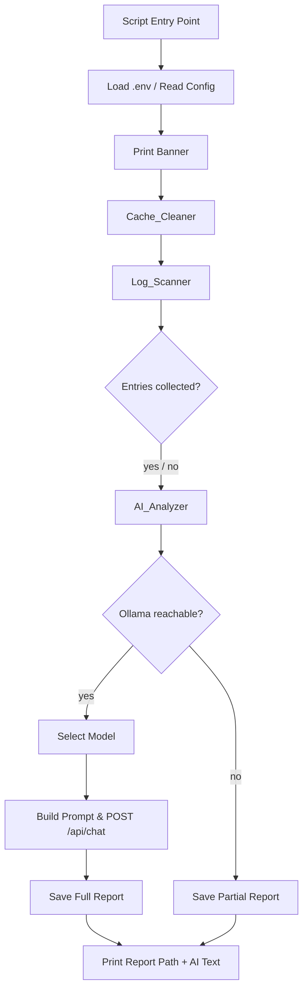

# Design Document: cache-log-analyzer

## Overview

`sc/cache_log_analyzer.py` is a standalone Python maintenance and diagnostic script for the FreqTrade GUI trading bot assistant project. It performs three sequential phases in a single run:

1. **Cache Cleaning** — removes `__pycache__` directories and `.pyc` files from the project tree (excluding `.venv/` and `.git/`).
2. **Log Scanning** — discovers all log files under `data/log/`, parses them, and collects `ERROR`, `CRITICAL`, `WARNING`, and anomaly-keyword entries.
3. **AI Analysis** — sends the collected events to a local Ollama model via `/api/chat` and saves a Markdown report to `data/app_event_analysis.md`.

The script is fully self-contained: it imports only Python stdlib, `requests`, and `python-dotenv`. No `app/` package imports are required.

---

## Architecture

The script is a single Python module with three logical components that execute in sequence. There is no class hierarchy — each component is a cohesive group of functions sharing a common data flow.



### Key Design Decisions

- **No app/ imports** — the script must be runnable without the application stack. All Ollama HTTP logic is re-implemented inline using `requests`, mirroring the pattern in `app/core/ai/providers/ollama_provider.py`.
- **Sequential, fail-soft execution** — each phase captures its own errors and passes partial results forward. A failure in one phase never aborts the others.
- **Single output file** — the report is always written to `data/app_event_analysis.md`, overwriting any previous run.

---

## Components and Interfaces

### 1. Configuration Loader

Reads environment variables after optionally loading a `.env` file.

```python
def load_config() -> dict:
    """Returns {'base_url': str, 'model': str}"""
```

- Calls `dotenv.load_dotenv()` if `python-dotenv` is available.
- Falls back to `http://localhost:11434` and `llama3`.

### 2. Cache_Cleaner

```python
def clean_cache(root: Path) -> CacheCleanResult:
    """
    Recursively removes __pycache__ dirs and .pyc files under root,
    skipping .venv/ and .git/ subtrees.
    Returns CacheCleanResult(dirs_removed, files_removed, errors).
    """
```

- Uses `os.walk` with `topdown=True`; prunes excluded dirs in-place.
- Catches `PermissionError` per path; prints warning and continues.
- Prints one confirmation line per deleted path.
- Prints a summary line at the end.

### 3. Log_Scanner

```python
LOG_ENTRY_RE = re.compile(
    r'^(?P<ts>\d{4}-\d{2}-\d{2} \d{2}:\d{2}:\d{2}\.\d+)'
    r'\s*\|\s*(?P<level>\w+)'
    r'\s*\|\s*(?P<name>[^|]+)'
    r'\s*\|\s*(?P<message>.+)$'
)

ANOMALY_KEYWORDS = frozenset([
    "exception", "traceback", "timeout", "failed",
    "refused", "connection error", "not found",
])

def scan_logs(log_dir: Path) -> LogScanResult:
    """
    Discovers *.log and *.log.* files, parses entries,
    collects Error_Entries and Unusual_Entries.
    Returns LogScanResult(entries, per_file_counts, truncated).
    """
```

- Lines not matching `LOG_ENTRY_RE` are silently skipped.
- Entries are sorted by timestamp after collection.
- If total entries > 200, keeps the 200 most recent and sets `truncated=True`.

### 4. AI_Analyzer

```python
def analyze_with_ollama(
    config: dict,
    cache_result: CacheCleanResult,
    scan_result: LogScanResult,
) -> str:
    """
    Performs health check, selects model, builds prompt, POSTs to /api/chat.
    Returns the AI response text, or an error message string.
    """
```

- Health check: `GET {base_url}/api/tags` — on failure, returns a descriptive error string.
- Model selection: prefers `config['model']`; falls back to first available; skips if none.
- Prompt construction: see Data Models section.
- POST: `{"model": ..., "messages": [...], "stream": false}` — mirrors `OllamaProvider.chat()`.

### 5. Report Writer

```python
def write_report(
    output_path: Path,
    cache_result: CacheCleanResult,
    scan_result: LogScanResult,
    ai_text: str,
    run_ts: str,
) -> None:
    """Writes the Markdown Analysis_Report to output_path."""
```

- Creates `data/` directory if absent.
- Overwrites any existing file.
- Prints the absolute path and the full AI text to stdout.

---

## Data Models

All models are plain dataclasses (no external dependencies).

```python
from dataclasses import dataclass, field
from typing import Optional

@dataclass
class LogEntry:
    timestamp: str      # raw string from log line
    level: str          # ERROR, CRITICAL, WARNING, INFO, DEBUG, ...
    name: str           # logger name
    message: str        # log message body
    source_file: str    # which log file this came from

@dataclass
class CacheCleanResult:
    dirs_removed: int = 0
    files_removed: int = 0
    errors: list[str] = field(default_factory=list)

@dataclass
class LogScanResult:
    entries: list[LogEntry] = field(default_factory=list)
    per_file_counts: dict[str, int] = field(default_factory=dict)
    truncated: bool = False
    original_count: int = 0
```

### Prompt Structure

The user message sent to Ollama is structured as:

```
## Cache Cleaning Summary
Removed {dirs} __pycache__ directories and {files} .pyc files.

## Log Scan Summary
Found {error_count} errors/criticals and {warning_count} warnings/anomalies
across {file_count} log file(s).
{truncation_note if truncated}

## Collected Log Entries
{timestamp} | {level} | {name} | {message}
...
```

The system prompt instructs the model to act as a senior Python developer, explain each issue in plain language, and provide numbered fix instructions.

---

## Correctness Properties

*A property is a characteristic or behavior that should hold true across all valid executions of a system — essentially, a formal statement about what the system should do. Properties serve as the bridge between human-readable specifications and machine-verifiable correctness guarantees.*

### Property 1: Cache exclusion invariant

*For any* directory tree containing `__pycache__` directories and `.pyc` files, after running the Cache_Cleaner, no `__pycache__` directory or `.pyc` file SHALL exist outside of `.venv/` or `.git/` subtrees, and all artifacts inside those excluded subtrees SHALL remain untouched.

**Validates: Requirements 1.1, 1.2**

---

### Property 2: Deletion count matches stdout summary

*For any* set of cache artifacts removed by the Cache_Cleaner, the summary line printed to stdout SHALL report a count equal to the actual number of directories and files deleted.

**Validates: Requirements 1.3, 1.4**

---

### Property 3: Log entry classification by level

*For any* log line whose level field is `ERROR` or `CRITICAL`, the Log_Scanner SHALL classify it as an Error_Entry; *for any* log line whose level field is `WARNING`, it SHALL be classified as an Unusual_Entry; *for any* log line whose level is neither of the above and whose message contains none of the anomaly keywords, it SHALL not appear in the collected entries list.

**Validates: Requirements 3.1, 3.2**

---

### Property 4: Anomaly keyword detection is case-insensitive

*For any* log entry whose message contains an anomaly keyword (`exception`, `traceback`, `timeout`, `failed`, `refused`, `connection error`, `not found`) in any combination of upper and lower case, the Log_Scanner SHALL classify it as an Unusual_Entry.

**Validates: Requirements 3.3**

---

### Property 5: Collected entries preserve timestamp order

*For any* set of log files containing Error_Entries and Unusual_Entries with distinct timestamps, the collected entries list returned by the Log_Scanner SHALL be sorted in ascending timestamp order.

**Validates: Requirements 2.4**

---

### Property 6: Prompt contains all required sections

*For any* CacheCleanResult and LogScanResult, the prompt constructed by the AI_Analyzer SHALL contain the cache cleaning summary, the error/warning counts, and the full text of every collected log entry.

**Validates: Requirements 5.1**

---

### Property 7: Report contains all required sections

*For any* run of the script, the generated Analysis_Report SHALL be a valid Markdown document containing a run-timestamp header, a cache cleaning summary section, a log scan summary section with per-file counts, an errors and warnings section listing each collected entry, and an AI analysis section.

**Validates: Requirements 6.2**

---

### Property 8: Environment variable configuration

*For any* combination of `OLLAMA_BASE_URL` and `OLLAMA_MODEL` environment variable values (including absent), the script SHALL use the provided values or fall back to `http://localhost:11434` and `llama3` respectively, and the banner printed at startup SHALL reflect the values actually in use.

**Validates: Requirements 7.2, 7.5**

---

## Error Handling

| Scenario | Behavior |
|---|---|
| `PermissionError` deleting cache artifact | Print warning with path + reason; continue |
| `data/log/` directory missing or empty | Print warning; pass empty entry list to AI_Analyzer |
| Malformed log line | Skip silently; do not raise |
| Ollama unreachable (connection error / non-200) | Print human-readable error; save partial report |
| Requested model not in available list | Print warning with available models; use first available |
| No models available on Ollama | Skip AI phase; save partial report |
| Ollama `/api/chat` returns non-200 or raises | Print error; save partial report noting AI failure |
| `data/` directory missing | Create it before writing report |

All phases are wrapped in top-level try/except blocks so that a failure in one phase never prevents subsequent phases from running or the report from being written.

---

## Testing Strategy

### Unit Tests (`tests/sc/test_cache_log_analyzer.py`)

Unit tests cover specific examples, edge cases, and error conditions using `pytest` with `unittest.mock` for HTTP calls and `tmp_path` fixtures for filesystem operations.

**Cache Cleaner:**
- Verify `__pycache__` dirs and `.pyc` files are removed from a temp tree.
- Verify `.venv/` and `.git/` subtrees are untouched.
- Verify `PermissionError` produces a warning and does not abort.

**Log Scanner:**
- Verify valid log lines are parsed into `LogEntry` fields.
- Verify malformed lines are skipped without exception.
- Verify `ERROR`/`CRITICAL` → Error_Entry, `WARNING` → Unusual_Entry.
- Verify anomaly keyword detection (case-insensitive).
- Verify truncation to 200 most recent entries when count > 200.
- Verify empty `data/log/` produces a warning and empty entry list.

**AI Analyzer:**
- Verify health check GET is called before POST.
- Verify model fallback when requested model is absent.
- Verify partial report is saved when Ollama is unreachable.
- Verify `stream: false` is set in the POST payload.

**Report Writer:**
- Verify `data/` directory is created if absent.
- Verify report contains all required Markdown sections.
- Verify absolute path is printed to stdout.

### Property-Based Tests (`tests/sc/test_cache_log_analyzer_properties.py`)

Uses **Hypothesis** (already present in the project via `.hypothesis/`) with a minimum of 100 iterations per property.

Each test is tagged with a comment in the format:
`# Feature: cache-log-analyzer, Property {N}: {property_text}`

**Property 1** — Cache exclusion invariant
Generate random directory trees with `__pycache__` and `.pyc` artifacts at various depths, including some under `.venv/` and `.git/`. Run `clean_cache()`. Assert no excluded artifacts remain outside protected subtrees and protected subtrees are unchanged.

**Property 2** — Deletion count matches stdout summary
Generate random sets of cache artifacts. Capture stdout. Assert the summary count equals `len(deleted_paths)`.

**Property 3** — Log entry classification by level
Generate random `LogEntry` instances with levels drawn from `{ERROR, CRITICAL, WARNING, INFO, DEBUG}` and messages without anomaly keywords. Assert classification matches expected category.

**Property 4** — Anomaly keyword detection is case-insensitive
Generate random log entries whose messages contain anomaly keywords with randomized casing. Assert all are classified as Unusual_Entry.

**Property 5** — Collected entries preserve timestamp order
Generate random lists of `LogEntry` instances with random timestamps. Assert the collected list is sorted ascending by timestamp.

**Property 6** — Prompt contains all required sections
Generate random `CacheCleanResult` and `LogScanResult` instances. Assert the constructed prompt string contains the cache summary, counts, and all entry texts.

**Property 7** — Report contains all required sections
Generate random inputs for all phases. Assert the written Markdown contains all required section headers and content.

**Property 8** — Environment variable configuration
Generate random URL strings and model name strings as env var values. Assert the config loader returns them correctly, and the banner reflects the active values.
