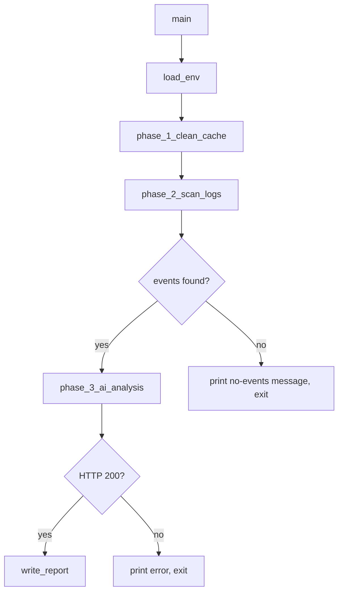

# Design Document: cache-log-analyzer

## Overview

`sc/cache_log_analyzer.py` is a standalone Python maintenance script that runs three sequential phases:

1. **Cache Cleanup** — walks the project tree and removes `__pycache__` directories and `.pyc` files, skipping `.venv/` and `.git/`.
2. **Log Scanning** — reads every file under `data/log/`, collects lines matching `ERROR`/`CRITICAL`/`WARNING` level markers or configurable anomaly keywords.
3. **AI Analysis** — sends the collected events to a local Ollama model via `/api/chat` and writes the Markdown response to `data/app_event_analysis.md`.

The script is self-contained: no imports from `app/`, stdlib + `requests` + `python-dotenv` only, runnable as `python sc/cache_log_analyzer.py` from the project root.

---

## Architecture

The script is a single-file, procedural Python module with no classes. Each phase is implemented as a top-level function called in sequence from `main()`.



**Design decisions:**
- Single file keeps deployment trivial (`python sc/cache_log_analyzer.py`).
- Procedural style avoids unnecessary abstraction for a script of this size.
- Each phase function returns a value (deleted paths, event lines, report content) so it can be unit-tested in isolation without running the full script.
- All I/O errors are caught and printed; no unhandled exceptions escape `main()`.

---

## Components and Interfaces

### `load_env() -> None`
Calls `dotenv.load_dotenv()` if `python-dotenv` is available, then reads `OLLAMA_BASE_URL` and `OLLAMA_MODEL` into module-level constants with fallbacks.

```python
OLLAMA_BASE_URL: str  # default "http://localhost:11434"
OLLAMA_MODEL: str     # default "llama3"
```

### `clean_cache(root: str) -> list[str]`
Walks `root`, collects and deletes `__pycache__` dirs and `.pyc` files, skipping any path containing `.venv` or `.git` as a path component. Returns the list of deleted paths.

```python
def clean_cache(root: str) -> list[str]: ...
```

### `scan_logs(log_dir: str, keywords: list[str]) -> list[str]`
Opens every file in `log_dir`, iterates lines, and collects those matching level markers (`ERROR`, `CRITICAL`, `WARNING`) or any keyword in `keywords` (case-insensitive). Returns the collected event lines. Prints a warning and continues on unreadable files.

```python
ANOMALY_KEYWORDS: list[str] = [
    "Traceback", "Exception", "exit code",
    "failed", "timeout", "connection refused",
]

def scan_logs(log_dir: str, keywords: list[str]) -> list[str]: ...
```

### `analyze_with_ollama(events: list[str], base_url: str, model: str) -> str | None`
Builds the `/api/chat` POST payload, sends it with `requests.post`, extracts the assistant message content from the JSON response. Returns the content string on success, `None` on any error (connection error or non-200 status), printing a human-readable error in the failure case.

```python
def analyze_with_ollama(
    events: list[str],
    base_url: str,
    model: str,
) -> str | None: ...
```

### `write_report(content: str, report_path: str) -> bool`
Prepends the generation timestamp header to `content` and writes the result to `report_path`, overwriting any existing file. Returns `True` on success, `False` on failure (printing an error message).

```python
def write_report(content: str, report_path: str) -> bool: ...
```

### `main() -> None`
Orchestrates the three phases in order, printing a phase header before each one.

---

## Data Models

### Ollama `/api/chat` Request Payload

```json
{
  "model": "<OLLAMA_MODEL>",
  "stream": false,
  "messages": [
    {
      "role": "system",
      "content": "You are a senior developer analysing application log events. Produce a structured Markdown report..."
    },
    {
      "role": "user",
      "content": "<joined event lines>"
    }
  ]
}
```

### Ollama `/api/chat` Response (relevant fields)

```json
{
  "message": {
    "role": "assistant",
    "content": "<markdown report text>"
  }
}
```

### Report File (`data/app_event_analysis.md`)

```
# App Event Analysis Report
Generated: YYYY-MM-DD

<assistant message content>
```

---

## Correctness Properties

*A property is a characteristic or behavior that should hold true across all valid executions of a system — essentially, a formal statement about what the system should do. Properties serve as the bridge between human-readable specifications and machine-verifiable correctness guarantees.*

### Property 1: Cache cleanup removes all targets and respects exclusions

*For any* directory tree containing `__pycache__` directories and `.pyc` files, after `clean_cache` runs: (a) no `__pycache__` directory or `.pyc` file remains outside `.venv/` or `.git/`, and (b) every path inside `.venv/` or `.git/` is untouched.

**Validates: Requirements 1.1, 1.2, 1.3**

### Property 2: Deleted paths are reported in stdout

*For any* set of Cache_Targets deleted by `clean_cache`, every deleted path SHALL appear in the list returned by the function (and thus in the printed output).

**Validates: Requirements 1.4**

### Property 3: Event collection completeness

*For any* set of log lines, `scan_logs` SHALL include in its result every line that contains `ERROR`, `CRITICAL`, or `WARNING` (case-sensitive), and every line that contains any Anomaly_Keyword (case-insensitive), and SHALL NOT include lines that match neither criterion.

**Validates: Requirements 2.2, 2.3**

### Property 4: All log files are scanned

*For any* set of files present in Log_Dir, events from every readable file SHALL appear in the Event_Collection (i.e. no file is silently skipped).

**Validates: Requirements 2.1**

### Property 5: Event collection is forwarded completely to Ollama

*For any* non-empty Event_Collection, the user message content sent in the `/api/chat` POST request SHALL contain every event line from the collection.

**Validates: Requirements 3.1, 3.3**

### Property 6: Report content round-trip

*For any* assistant message string returned by Ollama, writing it via `write_report` and reading the file back SHALL yield a string that contains the original assistant message content verbatim.

**Validates: Requirements 4.1**

### Property 7: Report header is always present

*For any* successful report write, the Report_File SHALL begin with the `# App Event Analysis Report` header followed by a `Generated:` timestamp line.

**Validates: Requirements 4.2**

### Property 8: Environment variable fallback correctness

*For any* combination of `OLLAMA_BASE_URL` and `OLLAMA_MODEL` being set or absent in the environment, the values used by the script SHALL equal the environment variable value when set, or the default (`http://localhost:11434` / `llama3`) when absent.

**Validates: Requirements 5.2**

---

## Error Handling

| Failure scenario | Behaviour |
|---|---|
| `__pycache__` / `.pyc` deletion fails (e.g. permission) | Print warning, continue |
| Log file unreadable | Print warning with filename, continue to next file |
| No events found after scanning | Print informational message, skip AI phase |
| `requests.post` raises `ConnectionError` / `Timeout` | Print human-readable error, return `None` from `analyze_with_ollama` |
| Ollama returns non-200 HTTP status | Print status code + response text, return `None` |
| `write_report` raises `OSError` | Print error with path, return `False` |

No unhandled exceptions escape `main()`. All error paths print to stdout (not stderr) for simplicity in a script context.

---

## Testing Strategy

### Unit Tests (example-based)

- `clean_cache` on a temp directory with no cache targets → returns empty list, prints "no cache files" message.
- `scan_logs` with a log file containing only `DEBUG` lines → returns empty list.
- `scan_logs` with an unreadable file → prints warning, returns events from other files.
- `analyze_with_ollama` with a mocked 200 response → returns assistant content string.
- `analyze_with_ollama` with a mocked connection error → returns `None`, no exception raised.
- `analyze_with_ollama` with a mocked 500 response → returns `None`, no exception raised.
- `write_report` with a mocked write failure → returns `False`, no exception raised.
- Phase headers appear in stdout in order: cleanup → scan → analysis.
- `.env` file values are loaded when present.

### Property-Based Tests (Hypothesis)

The feature involves pure transformation functions (path filtering, line matching, string building, file I/O) that are well-suited to property-based testing. Use **Hypothesis** (already available in the project via `.hypothesis/`).

Each property test runs a minimum of **100 iterations**.

Tag format: `# Feature: cache-log-analyzer, Property N: <property text>`

| Property | Test description |
|---|---|
| P1 | Generate random temp trees with `__pycache__`/`.pyc` at varying depths, some inside `.venv`/`.git`. After `clean_cache`, assert no targets remain outside exclusions and all exclusion paths are intact. |
| P2 | Generate random sets of cache targets, run `clean_cache`, assert returned list equals the set of actually-deleted paths. |
| P3 | Generate random log lines with/without level markers and keywords. Assert `scan_logs` result contains exactly the matching lines. |
| P4 | Generate multiple temp log files with known events. Assert events from every file appear in the result. |
| P5 | Generate random event line lists, mock `requests.post`, assert user message content in captured payload contains all event lines. |
| P6 | Generate random assistant message strings, write via `write_report` to a temp file, read back, assert original content is present. |
| P7 | Generate random assistant messages, write report, assert file starts with `# App Event Analysis Report\nGenerated:`. |
| P8 | Generate all four combinations of env var presence/absence, assert resolved URL and model match expected values. |
