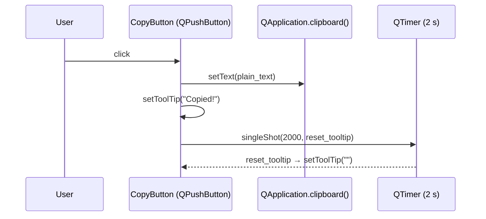

# Design Document: copy-context-chat-messages

## Overview

Add clipboard copy functionality in two places: (1) a copy button on every AI chat message bubble (both user and assistant), and (2) copy buttons on context/input display widgets across the app (terminal command input, pairs display label, path labels, and the strategy config path label).

## Main Algorithm/Workflow



---

## Part 1 — Chat Message Copy Buttons

### Core Interfaces/Types

```python
# app/ui/widgets/ai_message_widget.py  (modified)

class CopyButton(QPushButton):
    """Small icon-only copy button shown at the bottom of a message bubble."""

    def __init__(self, get_text: Callable[[], str], parent: QWidget | None = None) -> None:
        ...

    def _on_clicked(self) -> None:
        """Copy text to clipboard and flash tooltip for 2 s."""
        ...


class UserMessageWidget(QWidget):
    """Right-aligned user message bubble — unchanged public API."""

    def __init__(self, text: str, parent: QWidget | None = None) -> None:
        ...
    # NEW: _copy_btn: CopyButton added to layout


class AssistantMessageWidget(QWidget):
    """Left-aligned assistant message bubble — unchanged public API."""

    def __init__(self, parent: QWidget | None = None) -> None:
        ...

    def append_token(self, delta: str) -> None: ...
    def set_text(self, text: str) -> None: ...
    def _render(self, text: str) -> str: ...
    # NEW: _copy_btn: CopyButton added to layout
```

### Key Functions with Formal Specifications

#### `CopyButton.__init__(get_text, parent)`

```python
def __init__(
    self,
    get_text: Callable[[], str],
    parent: QWidget | None = None,
) -> None:
```

**Preconditions:**
- `get_text` is a zero-argument callable that returns `str`

**Postconditions:**
- Button is styled as a small, flat, icon-only button (📋, 16 px)
- `clicked` signal is connected to `_on_clicked`
- `get_text` is stored as `self._get_text`

#### `CopyButton._on_clicked()`

```python
def _on_clicked(self) -> None:
```

**Preconditions:**
- `self._get_text` is callable

**Postconditions:**
- `QApplication.clipboard().text()` equals `self._get_text()` after the call
- `self.toolTip()` equals `"Copied!"` immediately after the call
- After 2 000 ms, `self.toolTip()` equals `""`
- No exceptions propagate to the caller

#### `UserMessageWidget.__init__(text, parent)`

```python
def __init__(self, text: str, parent: QWidget | None = None) -> None:
```

**Preconditions:**
- `text` is a non-empty string (may contain newlines)

**Postconditions:**
- Message label displays `text` right-aligned
- A `CopyButton` is placed below the label, right-aligned
- `CopyButton._get_text()` returns `text` (the original plain text, not HTML)

#### `AssistantMessageWidget` — copy button wiring

The copy button's `get_text` lambda must always read `self._text` at call time (not capture the value at construction), so it reflects the final streamed content.

```python
# Inside AssistantMessageWidget.__init__:
self._copy_btn = CopyButton(get_text=lambda: self._text)
```

**Postconditions:**
- After `set_text(t)` or `append_token(delta)` calls, clicking the copy button copies the accumulated `self._text` (plain text, not rendered HTML)

---

## Part 2 — Context / Input Copy Buttons

### Scope of Changes

The following widgets/pages gain inline copy buttons next to read-only or semi-read-only text:

| Location | Widget | Text to copy |
|---|---|---|
| `TerminalWidget` | `command_input` (QLineEdit) | `self.get_command()` |
| `BacktestPage` | `pairs_display_label` (QLabel) | comma-separated pairs string |
| `BacktestPage` | `export_label` (QLabel) | export directory path |
| `StrategyConfigPage` | `_path_label` (QLabel) | strategy JSON file path |

> **Note:** The existing `copy_button` in `TerminalWidget` already copies the command. The design keeps it and ensures it follows the same 2-second tooltip flash pattern (it currently does via `QTimer.singleShot`). No duplicate button is added there — the existing one is already correct. The remaining three locations are new additions.

### Core Interfaces/Types

```python
# app/ui/widgets/copy_button.py  (NEW standalone module)

from typing import Callable
from PySide6.QtCore import QTimer
from PySide6.QtWidgets import QApplication, QPushButton, QWidget


class CopyButton(QPushButton):
    """Reusable flat copy button that copies text to the system clipboard.

    Args:
        get_text: Zero-argument callable returning the text to copy.
        label:    Button label; defaults to "📋".
        parent:   Optional parent widget.
    """

    def __init__(
        self,
        get_text: Callable[[], str],
        label: str = "📋",
        parent: QWidget | None = None,
    ) -> None:
        super().__init__(label, parent)
        self._get_text = get_text
        self.setFlat(True)
        self.setFixedSize(24, 24)
        self.setToolTip("Copy to clipboard")
        self.setObjectName("copy_btn")
        self.clicked.connect(self._on_clicked)

    def _on_clicked(self) -> None:
        """Copy text to clipboard and flash 'Copied!' tooltip for 2 s."""
        text = self._get_text()
        if text:
            QApplication.clipboard().setText(text)
        self.setToolTip("Copied!")
        QTimer.singleShot(2000, lambda: self.setToolTip("Copy to clipboard"))
```

### Key Functions with Formal Specifications

#### `CopyButton._on_clicked()`

```python
def _on_clicked(self) -> None:
```

**Preconditions:**
- `self._get_text` is callable and returns `str`

**Postconditions:**
- If `self._get_text()` is non-empty: `QApplication.clipboard().text() == self._get_text()`
- If `self._get_text()` is empty: clipboard is unchanged
- `self.toolTip() == "Copied!"` immediately after call
- After 2 000 ms: `self.toolTip() == "Copy to clipboard"`

### Algorithmic Pseudocode

#### Pairs Display Copy (BacktestPage)

```pascal
PROCEDURE _update_pairs_display(self)
  INPUT: self.selected_pairs (List[str])
  OUTPUT: side-effect — updates label text and copy button source

  count ← len(self.selected_pairs)
  self.pairs_button.setText(f"Select Pairs... ({count})")

  IF self.selected_pairs IS NOT EMPTY THEN
    display_text ← "Selected: " + join(self.selected_pairs, ", ")
    self.pairs_display_label.setText(display_text)
    // copy button lambda already captures self.selected_pairs by reference
  ELSE
    self.pairs_display_label.setText("Selected: None")
  END IF
END PROCEDURE
```

**Postconditions:**
- `pairs_copy_btn._get_text()` returns `", ".join(self.selected_pairs)` at any point after the call

#### Export Path Copy (BacktestPage)

```pascal
PROCEDURE _on_process_finished_internal(self, exit_code)
  ...
  // existing logic unchanged
  self.export_label.setText(f"Export dir: {cmd.export_dir}")
  // copy button lambda captures self._last_export_dir by reference
  ...
END PROCEDURE
```

**Postconditions:**
- `export_copy_btn._get_text()` returns `self._last_export_dir or ""`

#### Strategy Path Copy (StrategyConfigPage)

```pascal
PROCEDURE _load(self)
  ...
  // existing logic unchanged
  self._path_label.setText(str(json_path))
  // copy button lambda captures self._current_path by reference
  ...
END PROCEDURE
```

**Postconditions:**
- `path_copy_btn._get_text()` returns `str(self._current_path)` if loaded, else `""`

---

## Layout Changes

### Chat Message Bubbles

**Before** (`UserMessageWidget`):
```
┌─────────────────────────────────────────────────────┐
│                                    [message text]   │
└─────────────────────────────────────────────────────┘
```

**After**:
```
┌─────────────────────────────────────────────────────┐
│                                    [message text]   │
│                                               [📋]  │
└─────────────────────────────────────────────────────┘
```

**Before** (`AssistantMessageWidget`):
```
┌─────────────────────────────────────────────────────┐
│  [message text]                                     │
└─────────────────────────────────────────────────────┘
```

**After**:
```
┌─────────────────────────────────────────────────────┐
│  [message text]                                     │
│  [📋]                                               │
└─────────────────────────────────────────────────────┘
```

### Pairs Display (BacktestPage)

**Before**:
```
[Select Pairs... (3)]
Selected: BTC/USDT, ETH/USDT, SOL/USDT
```

**After**:
```
[Select Pairs... (3)]
Selected: BTC/USDT, ETH/USDT, SOL/USDT  [📋]
```

### Export Label (BacktestPage)

**Before**:
```
Export dir: /path/to/backtest_results/...
```

**After**:
```
Export dir: /path/to/backtest_results/...  [📋]
```

### Strategy Path Label (StrategyConfigPage)

**Before**:
```
/path/to/strategies/MyStrategy.json
```

**After**:
```
/path/to/strategies/MyStrategy.json  [📋]
```

---

## Example Usage

```python
# Standalone CopyButton usage
from app.ui.widgets.copy_button import CopyButton

# Static text
btn = CopyButton(get_text=lambda: "/some/path/to/file.json")

# Dynamic text — reads from widget at click time
pairs_copy = CopyButton(get_text=lambda: ", ".join(self.selected_pairs))

# In a QHBoxLayout next to a label
row = QHBoxLayout()
row.addWidget(self.pairs_display_label, 1)
row.addWidget(pairs_copy)
```

```python
# Chat message widget usage (ai_message_widget.py)
from app.ui.widgets.copy_button import CopyButton

class UserMessageWidget(QWidget):
    def __init__(self, text: str, parent=None):
        super().__init__(parent)
        layout = QVBoxLayout(self)
        layout.setContentsMargins(60, 4, 8, 4)

        label = QLabel(text)
        label.setWordWrap(True)
        label.setAlignment(Qt.AlignRight)
        label.setStyleSheet("background-color: #0e639c; color: #ffffff; ...")
        layout.addWidget(label)

        btn_row = QHBoxLayout()
        btn_row.addStretch()
        btn_row.addWidget(CopyButton(get_text=lambda: text))
        layout.addLayout(btn_row)
```

---

## Correctness Properties

```python
# Property 1: clipboard receives exact plain text
def prop_copy_sets_clipboard(get_text, copy_btn):
    copy_btn._on_clicked()
    assert QApplication.clipboard().text() == get_text()

# Property 2: empty text does not corrupt clipboard
def prop_empty_text_no_clipboard_change(copy_btn_empty):
    before = QApplication.clipboard().text()
    copy_btn_empty._on_clicked()  # get_text returns ""
    assert QApplication.clipboard().text() == before

# Property 3: tooltip flashes "Copied!" then resets
def prop_tooltip_flash(copy_btn, qtbot):
    copy_btn._on_clicked()
    assert copy_btn.toolTip() == "Copied!"
    qtbot.wait(2100)
    assert copy_btn.toolTip() == "Copy to clipboard"

# Property 4: assistant widget copy reflects final streamed text
def prop_assistant_copy_reflects_streamed_text(widget):
    widget.append_token("Hello ")
    widget.append_token("world")
    widget._copy_btn._on_clicked()
    assert QApplication.clipboard().text() == "Hello world"

# Property 5: user message copy returns original plain text (not HTML)
def prop_user_copy_is_plain_text(text):
    widget = UserMessageWidget(text)
    widget._copy_btn._on_clicked()
    assert QApplication.clipboard().text() == text
    assert "<" not in QApplication.clipboard().text()  # no HTML tags
```

---

## Files to Create / Modify

| File | Action | Description |
|---|---|---|
| `app/ui/widgets/copy_button.py` | **CREATE** | Standalone `CopyButton` widget |
| `app/ui/widgets/ai_message_widget.py` | **MODIFY** | Add `CopyButton` to `UserMessageWidget` and `AssistantMessageWidget` |
| `app/ui/pages/backtest_page.py` | **MODIFY** | Add copy buttons next to `pairs_display_label` and `export_label` |
| `app/ui/pages/strategy_config_page.py` | **MODIFY** | Add copy button next to `_path_label` |

> `TerminalWidget.copy_button` already exists and already uses the 2-second tooltip flash pattern — no changes needed there.

---

## Dependencies

- `PySide6.QtWidgets`: `QPushButton`, `QApplication`, `QWidget`, `QHBoxLayout`, `QVBoxLayout`
- `PySide6.QtCore`: `QTimer`
- No new third-party packages required
