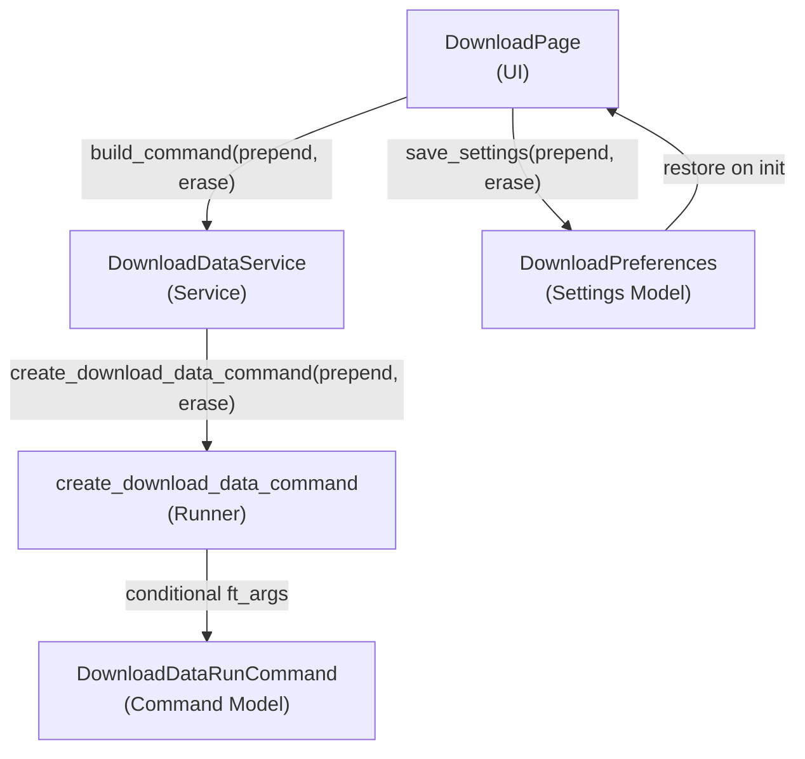

# Design Document

## Feature: download-data-prepend-erase

---

## Overview

The Download Data page currently hardcodes `--prepend` into every `freqtrade download-data` command. This feature removes that hardcoded flag and exposes both `--prepend` and `--erase` as user-controlled checkboxes in the UI. The user's selections are threaded from the UI layer through the service layer to the runner, and the chosen values are persisted in `DownloadPreferences` so they survive app restarts.

The change touches four files in a strict top-down order that mirrors the existing layered architecture:

```
UI (download_page.py)
  → Service (download_data_service.py)
    → Runner (download_data_runner.py)
      → Model (settings_models.py / DownloadPreferences)
```

No new files, no new abstractions — only targeted additions to existing modules.

---

## Architecture

The feature follows the existing command-building pipeline unchanged. The only structural addition is two boolean parameters flowing through each layer:



The runner is the only place where the boolean values are translated into CLI flags. Every layer above it simply passes the values through without interpreting them.

---

## Components and Interfaces

### 1. `DownloadPreferences` — `app/core/models/settings_models.py`

Two new fields are added to the existing Pydantic model:

```python
class DownloadPreferences(BaseModel):
    # ... existing fields ...
    prepend: bool = Field(False, description="Include --prepend flag in download command")
    erase: bool = Field(False, description="Include --erase flag in download command")
```

Both fields default to `False`, which is backward-compatible: existing `settings.json` files that lack these keys will deserialize correctly via Pydantic's default handling.

### 2. `create_download_data_command` — `app/core/freqtrade/runners/download_data_runner.py`

The function signature gains two optional boolean parameters. The hardcoded `"--prepend"` entry is removed from `ft_args` and replaced with conditional appends:

```python
def create_download_data_command(
    settings: AppSettings,
    timeframe: str,
    timerange: Optional[str] = None,
    pairs: Optional[List[str]] = None,
    prepend: bool = False,
    erase: bool = False,
) -> DownloadDataRunCommand:
    ...
    ft_args = [
        "download-data",
        "--user-data-dir", str(paths.user_data_dir),
        "--config", str(paths.config_file),
        "--timeframe", timeframe,
    ]
    if prepend:
        ft_args.append("--prepend")
    if erase:
        ft_args.append("--erase")
    if timerange:
        ft_args += ["--timerange", timerange]
    if pairs:
        ft_args += ["-p"] + list(pairs)
    ...
```

The `--prepend` and `--erase` flags are appended immediately after the fixed positional arguments and before the optional `--timerange` / `-p` arguments, matching the conventional ordering of freqtrade CLI flags.

### 3. `DownloadDataService.build_command` — `app/core/services/download_data_service.py`

Two new keyword parameters are added and forwarded directly to the runner:

```python
def build_command(
    self,
    timeframe: str,
    timerange: Optional[str] = None,
    pairs: Optional[List[str]] = None,
    prepend: bool = False,
    erase: bool = False,
) -> DownloadDataRunCommand:
    settings = self.settings_service.load_settings()
    return create_download_data_command(
        settings=settings,
        timeframe=timeframe,
        timerange=timerange,
        pairs=pairs or [],
        prepend=prepend,
        erase=erase,
    )
```

The service does not interpret the booleans — it is a pure pass-through. This keeps the service layer thin and the runner as the single source of truth for CLI flag construction.

### 4. `DownloadPage` — `app/ui/pages/download_page.py`

Three changes are made to the page:

**a) Two `QCheckBox` widgets** are added to the Configuration section of the left panel, below the Timerange `QFormLayout` row and above the Pairs section header:

```python
from PySide6.QtWidgets import QCheckBox

self._prepend_cb = QCheckBox("Prepend data")
self._erase_cb   = QCheckBox("Erase existing data")
```

Both are initialized to unchecked by default, then overridden during `_restore_preferences()`.

**b) `_run()` reads checkbox state** and passes it to `build_command`:

```python
cmd = self._download_svc.build_command(
    timeframe=self._tf_combo.currentText(),
    timerange=timerange,
    pairs=pairs,
    prepend=self._prepend_cb.isChecked(),
    erase=self._erase_cb.isChecked(),
)
```

**c) Preferences are saved and restored.** A `_save_preferences()` helper is called at the end of `_run()` (after the command is built successfully), and `_restore_preferences()` is called at the end of `_build()`:

```python
def _save_preferences(self) -> None:
    settings = self._settings_svc.load_settings()
    settings.download_preferences.prepend = self._prepend_cb.isChecked()
    settings.download_preferences.erase   = self._erase_cb.isChecked()
    self._settings_svc.save_settings(settings)

def _restore_preferences(self) -> None:
    settings = self._settings_svc.load_settings()
    prefs = settings.download_preferences
    self._prepend_cb.setChecked(prefs.prepend)
    self._erase_cb.setChecked(prefs.erase)
```

`blockSignals` is not needed here because the checkboxes have no connected signals that trigger side effects.

---

## Data Models

### `DownloadPreferences` (updated)

| Field | Type | Default | Description |
|---|---|---|---|
| `default_timeframe` | `str` | `"5m"` | Default timeframe (existing) |
| `default_timerange` | `str` | `""` | Default timerange (existing) |
| `default_pairs` | `str` | `""` | Comma-separated pairs (existing) |
| `paired_favorites` | `list[str]` | `[...]` | Favorite pairs (existing) |
| `last_timerange_preset` | `str` | `"30d"` | Last preset (existing) |
| `prepend` | `bool` | `False` | **New** — persist --prepend checkbox state |
| `erase` | `bool` | `False` | **New** — persist --erase checkbox state |

Pydantic's default handling means existing `settings.json` files without these keys will deserialize to `False` without error. No migration is required.

### `DownloadDataRunCommand` (unchanged)

The dataclass is not modified. The `prepend` and `erase` booleans are consumed by the runner and translated into CLI flag strings before the `DownloadDataRunCommand` is constructed. The command model carries only the final resolved argument list.

---

## Correctness Properties

*A property is a characteristic or behavior that should hold true across all valid executions of a system — essentially, a formal statement about what the system should do. Properties serve as the bridge between human-readable specifications and machine-verifiable correctness guarantees.*

The runner's flag-construction logic is a pure function of its boolean inputs and is well-suited to property-based testing. The UI and service layers are tested with targeted examples.

### Property 1: Prepend flag presence matches parameter

*For any* valid combination of `timeframe`, `timerange`, `pairs`, and `erase` values, the `--prepend` flag SHALL appear in the generated argument list if and only if `prepend=True`.

**Validates: Requirements 2.1, 2.2**

### Property 2: Erase flag presence matches parameter

*For any* valid combination of `timeframe`, `timerange`, `pairs`, and `prepend` values, the `--erase` flag SHALL appear in the generated argument list if and only if `erase=True`.

**Validates: Requirements 4.2, 4.3**

### Property 3: Preferences round-trip

*For any* combination of `prepend` and `erase` boolean values, saving those values to `DownloadPreferences` and then loading them back SHALL produce the same boolean values.

**Validates: Requirements 6.3, 6.4, 6.5**

---

## Error Handling

This feature introduces no new error conditions. The two boolean parameters have safe defaults (`False`) and require no validation — any `bool` value is valid. The existing error paths in `_run()` (settings not configured, no pairs selected, command build failure) are unchanged.

The `_save_preferences()` call is placed after a successful `build_command()` call, so preferences are only persisted when the command was constructed without error. If `save_settings` raises (e.g. disk full), the exception propagates to `_run()` where it is caught by the existing broad `except Exception` handler and displayed in the terminal.

---

## Testing Strategy

### Unit Tests (example-based)

These cover the concrete, non-varying behaviors:

- `DownloadPreferences` instantiates with `prepend=False` and `erase=False` by default (Requirements 6.1, 6.2)
- `create_download_data_command` called without `prepend`/`erase` kwargs succeeds and produces neither flag (Requirements 2.3, 4.1)
- `DownloadDataService.build_command` called without `prepend`/`erase` kwargs succeeds (Requirements 3.1, 3.2)
- `DownloadPage` initializes with both checkboxes unchecked when preferences are default (Requirements 1.4, 1.5)
- `DownloadPage` restores `prepend=True` from preferences on init (Requirement 6.4)
- `DownloadPage` restores `erase=True` from preferences on init (Requirement 6.5)
- Both checkboxes unchecked → command contains neither flag (Requirement 5.3)
- Both checkboxes checked → command contains both flags (Requirement 5.4)

### Property-Based Tests (Hypothesis)

Three property tests using [Hypothesis](https://hypothesis.readthedocs.io/):

**Property 1 — Prepend flag presence matches parameter**

```
@given(
    timeframe=st.sampled_from(["1m", "5m", "1h", "1d"]),
    timerange=st.one_of(st.none(), st.text(min_size=1, max_size=20)),
    pairs=st.lists(st.text(min_size=3, max_size=10), max_size=5),
    erase=st.booleans(),
    prepend=st.booleans(),
)
@settings(max_examples=100)
def test_prepend_flag_matches_parameter(timeframe, timerange, pairs, erase, prepend):
    # Feature: download-data-prepend-erase, Property 1: prepend flag presence matches parameter
    cmd = create_download_data_command(settings=mock_settings, timeframe=timeframe,
                                       timerange=timerange, pairs=pairs,
                                       prepend=prepend, erase=erase)
    assert ("--prepend" in cmd.args) == prepend
```

**Property 2 — Erase flag presence matches parameter**

```
# Feature: download-data-prepend-erase, Property 2: erase flag presence matches parameter
# Same generators as Property 1
assert ("--erase" in cmd.args) == erase
```

**Property 3 — Preferences round-trip**

```
@given(prepend=st.booleans(), erase=st.booleans())
@settings(max_examples=100)
def test_preferences_round_trip(prepend, erase):
    # Feature: download-data-prepend-erase, Property 3: preferences round-trip
    prefs = DownloadPreferences(prepend=prepend, erase=erase)
    serialized = prefs.model_dump()
    restored = DownloadPreferences(**serialized)
    assert restored.prepend == prepend
    assert restored.erase == erase
```

Properties 1 and 2 use a minimal `AppSettings` mock (with `python_executable` and `user_data_path` set to valid-looking paths) to avoid filesystem access. The runner's flag logic is pure enough that 100 iterations will exercise all meaningful combinations of the optional parameters.

Property 3 tests the Pydantic model's serialization round-trip, which is the mechanism underlying the persistence requirement.
