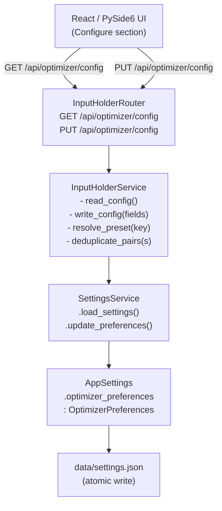

# Design Document: Input Holder Backend Persistence

## Overview

This feature moves the source of truth for the seven Configure-section fields (Strategy, Timeframe, Preset, Timerange, Wallet, Max Trades, and Pairs) from ephemeral UI state to the Python backend. The UI becomes a thin view: it reads initial values from the backend on page load and pushes changes back on every user edit.

The implementation adds two new components — `InputHolderService` and `InputHolderRouter` — that sit on top of the existing `SettingsService` / `OptimizerPreferences` / `AppSettings` persistence stack. No new persistence mechanism is introduced; all writes go through `SettingsService.update_preferences`, which uses `write_json_file_atomic` internally.

### Key Design Decisions

- **No new persistence layer**: reuse `SettingsService` and `data/settings.json` rather than introducing a separate store.
- **`OptimizerPreferences` is the data contract**: the existing Pydantic model already lives in `AppSettings`; we extend it with the missing fields and add validation.
- **Partial updates via PUT**: the write endpoint accepts a partial payload (only the fields being changed), merges with the current state, and returns the full updated object.
- **Preset resolution is server-side**: the backend computes `YYYYMMDD-YYYYMMDD` from a named preset key so the UI never needs to do date arithmetic.
- **Pairs deduplication is server-side**: the service deduplicates while preserving insertion order before persisting.

---

## Architecture



The `InputHolderRouter` is a thin FastAPI router: it validates HTTP concerns (request parsing, HTTP status codes) and delegates all business logic to `InputHolderService`. The service owns preset resolution, pairs deduplication, and field validation beyond what Pydantic provides. `SettingsService` owns atomicity and file I/O.

---

## Components and Interfaces

### `InputHolderService` (`app/core/services/input_holder_service.py`)

```python
class InputHolderService:
    def __init__(self, settings_service: SettingsService) -> None: ...

    def read_config(self) -> OptimizerConfigResponse:
        """Load OptimizerPreferences and return the full response DTO."""

    def write_config(self, update: OptimizerConfigUpdate) -> OptimizerConfigResponse:
        """Validate, resolve preset, deduplicate pairs, persist, return updated state.

        Raises:
            ValueError: for invalid field values (dry_run_wallet <= 0, max_open_trades < 1,
                        unknown field names).
            RuntimeError: propagated from SettingsService on disk write failure.
        """

    @staticmethod
    def resolve_preset(key: str, today: date | None = None) -> str | None:
        """Return YYYYMMDD-YYYYMMDD for a known preset key, or None if unknown."""

    @staticmethod
    def deduplicate_pairs(pairs_str: str) -> str:
        """Remove duplicate entries from a comma-separated pairs string,
        preserving insertion order."""
```

### `InputHolderRouter` (`app/web/api/routes/input_holder.py`)

```python
router = APIRouter()

@router.get("/optimizer/config", response_model=OptimizerConfigResponse, tags=["optimizer-config"])
async def get_optimizer_config(settings: SettingsServiceDep) -> OptimizerConfigResponse: ...

@router.put("/optimizer/config", response_model=OptimizerConfigResponse, tags=["optimizer-config"])
async def put_optimizer_config(
    update: OptimizerConfigUpdate,
    settings: SettingsServiceDep,
) -> OptimizerConfigResponse: ...
```

The router instantiates `InputHolderService(settings)` per-request (lightweight — no state). `SettingsServiceDep` is injected via the existing `app/web/dependencies.py` pattern.

### Registration in `app/web/main.py`

```python
from app.web.api.routes import input_holder
app.include_router(input_holder.router, prefix="/api", tags=["optimizer-config"])
```

---

## Data Models

### `OptimizerPreferences` (extended, `app/core/models/optimizer_models.py`)

The existing model already has most fields. The required fields per Requirement 1.1 are confirmed present:

| Field | Type | Default | Notes |
|---|---|---|---|
| `last_strategy` | `str` | `""` | Strategy name |
| `default_timeframe` | `str` | `"5m"` | Timeframe string |
| `last_timerange_preset` | `str` | `"30d"` | Named preset key |
| `default_timerange` | `str` | `""` | `YYYYMMDD-YYYYMMDD` |
| `default_pairs` | `str` | `""` | Comma-separated pairs |
| `dry_run_wallet` | `float` | `80.0` | Must be > 0 |
| `max_open_trades` | `int` | `2` | Must be >= 1 |

Validation additions needed:
- `dry_run_wallet`: add `@field_validator` to reject values `<= 0`
- `max_open_trades`: add `@field_validator` to reject values `< 1`

### `OptimizerConfigUpdate` (new request DTO)

```python
class OptimizerConfigUpdate(BaseModel):
    """Partial update payload for PUT /api/optimizer/config.
    All fields are optional — only provided fields are updated."""
    model_config = ConfigDict(extra="forbid")  # HTTP 422 on unknown fields

    last_strategy: str | None = None
    default_timeframe: str | None = None
    last_timerange_preset: str | None = None
    default_timerange: str | None = None
    default_pairs: str | None = None
    dry_run_wallet: float | None = None
    max_open_trades: int | None = None
```

`extra="forbid"` causes Pydantic to raise `ValidationError` on unknown fields, which FastAPI automatically maps to HTTP 422.

### `OptimizerConfigResponse` (new response DTO)

```python
class OptimizerConfigResponse(BaseModel):
    """Full state returned by GET and PUT /api/optimizer/config."""
    last_strategy: str
    default_timeframe: str
    last_timerange_preset: str
    default_timerange: str
    default_pairs: str
    pairs_list: list[str]          # parsed from default_pairs
    dry_run_wallet: float
    max_open_trades: int
```

`pairs_list` is computed at response-build time by splitting `default_pairs` on commas and stripping whitespace. It is never persisted separately.

### Preset Resolution Table

| Key | Days back | Example (today = 20250101) |
|---|---|---|
| `"7d"` | 7 | `20241225-20250101` |
| `"14d"` | 14 | `20241218-20250101` |
| `"30d"` | 30 | `20241202-20250101` |
| `"60d"` | 60 | `20241102-20250101` |
| `"90d"` | 90 | `20241003-20250101` |
| `"180d"` | 180 | `20240705-20250101` |
| `"1y"` | 365 | `20240101-20250101` |

Resolution formula: `start = today - timedelta(days=N)`, `result = f"{start:%Y%m%d}-{today:%Y%m%d}"`.

---

## Correctness Properties

*A property is a characteristic or behavior that should hold true across all valid executions of a system — essentially, a formal statement about what the system should do. Properties serve as the bridge between human-readable specifications and machine-verifiable correctness guarantees.*

### Property 1: OptimizerPreferences JSON round-trip

*For any* valid `OptimizerPreferences` instance with arbitrary field values, serializing it to JSON via `model_dump(mode="json")` and then deserializing via `model_validate` SHALL produce an instance equal to the original.

**Validates: Requirements 1.3**

---

### Property 2: Type constraint violations raise ValidationError

*For any* `OptimizerPreferences` field, supplying a value that violates the field's type constraint (e.g., a non-numeric string for `dry_run_wallet`, a float for `max_open_trades`) SHALL raise a `ValidationError` identifying the offending field.

**Validates: Requirements 1.4**

---

### Property 3: Read-your-writes consistency

*For any* valid `OptimizerConfigUpdate` payload (with arbitrary combinations of the seven fields), issuing a `PUT /api/optimizer/config` followed immediately by `GET /api/optimizer/config` SHALL return values that match the written payload for every field that was included in the update.

**Validates: Requirements 2.2, 3.2, 3.3, 7.3**

---

### Property 4: Unknown fields rejected with HTTP 422

*For any* PUT request body that contains at least one field name not in the `OptimizerConfigUpdate` schema, the endpoint SHALL return HTTP 422 and SHALL NOT modify the persisted state.

**Validates: Requirements 3.4**

---

### Property 5: Wallet and trades boundary validation

*For any* `dry_run_wallet` value that is less than or equal to zero, or any `max_open_trades` value that is less than 1, a `PUT /api/optimizer/config` request containing that value SHALL return HTTP 422 and SHALL NOT modify the persisted state.

**Validates: Requirements 3.6, 3.7**

---

### Property 6: Known preset resolution produces valid YYYYMMDD-YYYYMMDD

*For any* known preset key (`"7d"`, `"14d"`, `"30d"`, `"60d"`, `"90d"`, `"180d"`, `"1y"`) and any UTC date, `InputHolderService.resolve_preset(key, today)` SHALL return a string matching the pattern `YYYYMMDD-YYYYMMDD` where the start date is exactly `N` days before `today` and the end date equals `today`.

**Validates: Requirements 4.2**

---

### Property 7: Preset resolution idempotence

*For any* known preset key, calling `resolve_preset(key, today)` twice with the same `today` value SHALL return the same `YYYYMMDD-YYYYMMDD` string both times.

**Validates: Requirements 4.4**

---

### Property 8: Unknown preset does not overwrite existing timerange

*For any* string that is not a known preset key, issuing a `PUT /api/optimizer/config` with `last_timerange_preset=<unknown>` and an existing `default_timerange` SHALL persist the unknown preset string as-is and SHALL leave `default_timerange` unchanged.

**Validates: Requirements 4.3**

---

### Property 9: Pairs deduplication preserves insertion order

*For any* comma-separated pairs string that contains duplicate entries, `InputHolderService.deduplicate_pairs` SHALL return a string whose parsed list contains no duplicates and whose relative order matches the first occurrence of each pair in the input.

**Validates: Requirements 5.3**

---

### Property 10: Pairs response includes both raw string and parsed list

*For any* stored `default_pairs` value, the `GET /api/optimizer/config` response SHALL include both `default_pairs` (the raw comma-separated string) and `pairs_list` (a `List[str]` whose join with `","` equals the deduplicated `default_pairs`).

**Validates: Requirements 5.2**

---

## Error Handling

| Scenario | Component | HTTP Status | Behavior |
|---|---|---|---|
| Unknown field in PUT body | Pydantic (`extra="forbid"`) | 422 | FastAPI auto-maps `ValidationError` |
| `dry_run_wallet <= 0` | `InputHolderService.write_config` | 422 | Raise `ValueError`, router maps to 422 |
| `max_open_trades < 1` | `InputHolderService.write_config` | 422 | Raise `ValueError`, router maps to 422 |
| Disk write failure | `SettingsService.update_preferences` raises `RuntimeError` | 500 | Router catches `RuntimeError`, returns 500 with message |
| Settings file missing on GET | `SettingsService.load_settings` returns defaults | 200 | `OptimizerPreferences()` defaults returned |
| Malformed `settings.json` | `SettingsService.load_settings` logs error, returns defaults | 200 | Graceful degradation to defaults |

The router uses a narrow exception handler pattern:

```python
try:
    result = InputHolderService(settings).write_config(update)
except ValueError as exc:
    raise HTTPException(status_code=422, detail=str(exc)) from exc
except RuntimeError as exc:
    raise HTTPException(status_code=500, detail=str(exc)) from exc
```

No partial success responses are ever returned — a write either fully succeeds (HTTP 200 with full state) or fails (HTTP 422 or 500).

---

## Testing Strategy

### Unit Tests (`tests/unit/`)

Focus on specific examples, edge cases, and error conditions:

- `test_optimizer_preferences_defaults` — construct with no args, assert all seven fields have non-empty/non-zero defaults (Req 1.2)
- `test_optimizer_preferences_validation_errors` — supply invalid types, assert `ValidationError` (Req 1.4)
- `test_resolve_preset_all_known_keys` — call `resolve_preset` for each of the 7 known keys, assert valid format (Req 4.1)
- `test_resolve_preset_unknown_key_returns_none` — unknown key returns `None` (Req 4.3)
- `test_deduplicate_pairs_empty_string` — empty input returns empty string
- `test_last_strategy_empty_string_not_null` — PUT with `last_strategy=""`, GET returns `""` not `null` (Req 6.3)
- `test_disk_write_failure_returns_500` — mock `SettingsService` to raise `RuntimeError`, assert HTTP 500 (Req 3.5)
- `test_concurrent_writes_serialized` — two concurrent PUTs, assert final state is one complete update (Req 7.2)

### Property-Based Tests (`tests/property/`) — using Hypothesis

Property-based testing is appropriate here because the feature involves data transformation logic (preset resolution, pairs deduplication, JSON serialization) and REST API contracts where input variation meaningfully exercises edge cases.

**Library**: [Hypothesis](https://hypothesis.readthedocs.io/) (already present in the project via `.hypothesis/` directory)

**Minimum iterations**: 100 per property (Hypothesis default `max_examples=100`)

Each test is tagged with a comment referencing the design property:
`# Feature: input-holder-backend-persistence, Property N: <property_text>`

| Test | Property | Strategy |
|---|---|---|
| `test_optimizer_preferences_round_trip` | Property 1 | `@given(st.builds(OptimizerPreferences, ...))` — generate random instances, serialize/deserialize, assert equality |
| `test_type_constraint_violations` | Property 2 | `@given` invalid type values for each field, assert `ValidationError` |
| `test_read_your_writes` | Property 3 | `@given` random `OptimizerConfigUpdate` payloads, PUT then GET via `TestClient`, assert fields match |
| `test_unknown_fields_rejected` | Property 4 | `@given(st.text())` for field names not in schema, assert HTTP 422 and state unchanged |
| `test_wallet_trades_boundary` | Property 5 | `@given(st.floats(max_value=0.0))` and `@given(st.integers(max_value=0))`, assert HTTP 422 |
| `test_preset_resolution_format` | Property 6 | `@given(st.sampled_from(KNOWN_PRESETS), st.dates())`, assert format and date arithmetic |
| `test_preset_idempotence` | Property 7 | `@given(st.sampled_from(KNOWN_PRESETS), st.dates())`, resolve twice, assert equal |
| `test_unknown_preset_preserves_timerange` | Property 8 | `@given(st.text().filter(lambda s: s not in KNOWN_PRESETS), st.text())`, assert timerange unchanged |
| `test_pairs_deduplication_order` | Property 9 | `@given(st.lists(st.text()))` with duplicates injected, assert no duplicates and order preserved |
| `test_pairs_response_consistency` | Property 10 | `@given(st.text())` for pairs strings, GET, assert `",".join(pairs_list) == default_pairs` |

### Integration / Smoke Tests

- Verify `GET /api/optimizer/config` and `PUT /api/optimizer/config` appear in `/openapi.json` (Req 8.1, 8.3)
- Verify router uses `SettingsServiceDep` (code inspection / import check) (Req 8.2)
