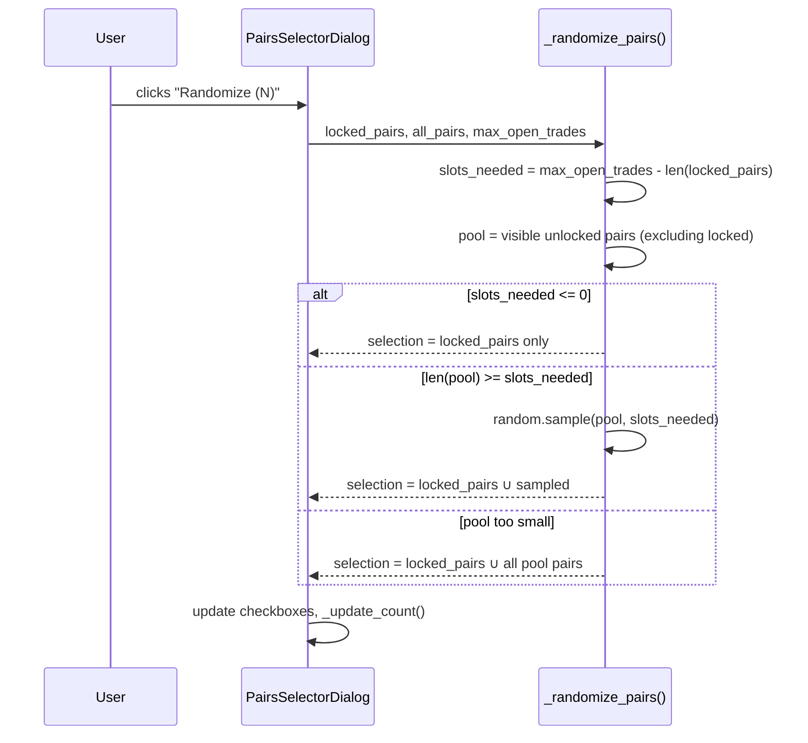
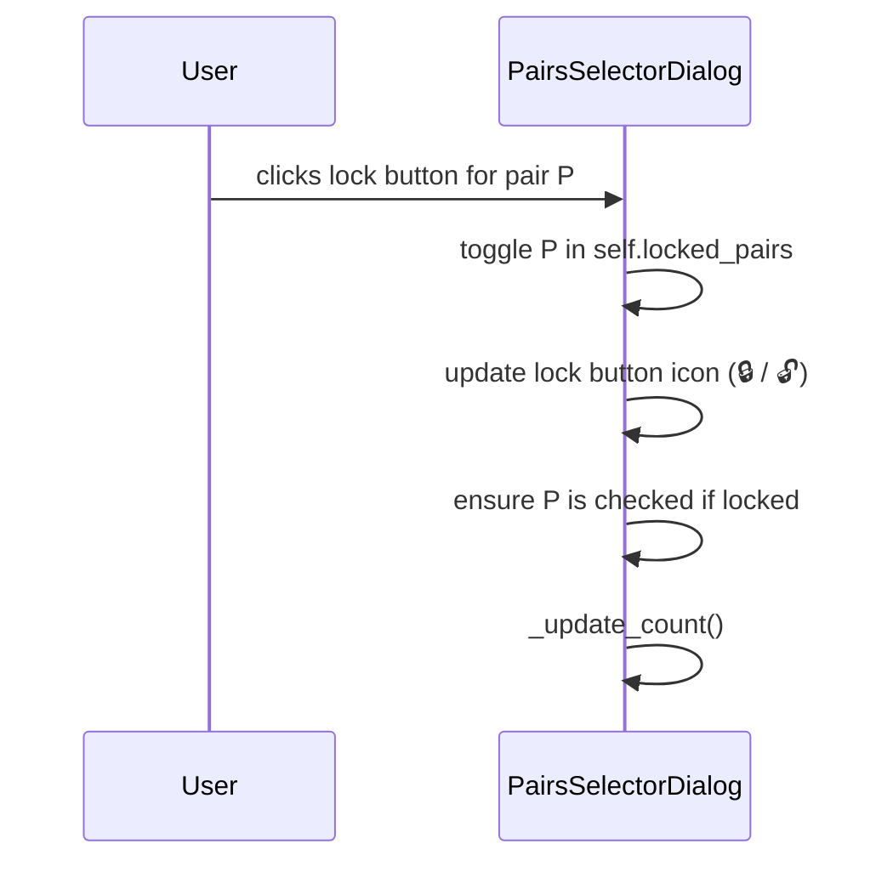

# Design Document: Pairs Selector — Randomize with Lock

## Overview

Adds a **Randomize** button to `PairsSelectorDialog` that automatically selects N pairs at random, where N is read from `max_open_trades` passed in by the caller. Users can also **lock** individual pairs so they are always kept in the selection and never replaced during randomization. Randomization fills the remaining slots (`max_open_trades − locked_count`) from the pool of unlocked, available pairs.

The feature is purely a UI enhancement inside the existing dialog. No new service, state class, or model is required — `max_open_trades` is already stored in `BacktestPreferences` and `OptimizePreferences` and is passed in at dialog construction time.

---

## Architecture

The change is confined to the UI layer. The dialog already receives `SettingsState`; the caller pages (`BacktestPage`, `OptimizePage`) already hold `max_open_trades` as a `QSpinBox` value. The simplest, least-coupled approach is to pass `max_open_trades` as a plain `int` constructor argument to the dialog — the same pattern used for `favorites` and `selected`.

```mermaid
graph TD
    BP[BacktestPage / OptimizePage]
    BP -->|max_open_trades: int| PSD[PairsSelectorDialog]
    PSD -->|locked_pairs: set[str]| RL[Randomize Logic]
    PSD -->|available unlocked pairs| RL
    RL -->|new selection| PSD
    PSD -->|get_selected_pairs()| BP
```

No changes are needed in the service, state, or model layers.

---

## Sequence Diagrams

### Randomize Flow



### Lock Toggle Flow



---

## Components and Interfaces

### Modified: `PairsSelectorDialog`

**New constructor parameter:**

```python
def __init__(
    self,
    favorites: List[str],
    selected: List[str],
    settings_state: SettingsState,
    max_open_trades: int = 1,
    parent=None,
)
```

**New instance state:**

```python
self.locked_pairs: set[str] = set()          # pairs the user has locked
self.max_open_trades: int = max_open_trades  # slot budget for randomization
```

**New UI elements (added to the action row area):**

| Widget | Type | Purpose |
|--------|------|---------|
| `randomize_btn` | `QPushButton` | Triggers randomization; label shows "🎲 Randomize (N)" |
| Lock button per row | `QPushButton` (flat) | Toggles lock state for that pair; stored in `self.lock_buttons: dict[str, QPushButton]` |

**New / modified methods:**

| Method | Signature | Description |
|--------|-----------|-------------|
| `_make_lock_button` | `(pair: str) → QPushButton` | Creates a flat lock-toggle button for a row |
| `_on_lock_clicked` | `(pair: str) → None` | Toggles `locked_pairs`, updates icon, ensures pair is checked |
| `_randomize_pairs` | `() → None` | Core randomization logic; updates checkboxes |
| `_update_randomize_label` | `() → None` | Keeps button label in sync with `max_open_trades` |
| `_build_rows` | *(modified)* | Inserts lock button as third widget in each row |
| `_on_add_custom` | *(modified)* | Creates lock button for newly added custom pairs |

### Callers: `BacktestPage` and `OptimizePage`

Both pages already have `self.max_open_trades` as a `QSpinBox`. The only change is passing its current value when constructing the dialog:

```python
dialog = PairsSelectorDialog(
    favorites=favorites,
    selected=self.selected_pairs,
    settings_state=self.settings_state,
    max_open_trades=self.max_open_trades.value(),  # ← new
    parent=self,
)
```

---

## Data Models

No new Pydantic models are needed. Lock state is ephemeral — it lives only for the lifetime of the dialog and is not persisted. This is intentional: locks are a "this session" convenience, not a saved preference.

### Row widget layout (per pair)

```
[ 🔒 lock btn ] [ ♥ fav btn ] [ ☑ checkbox (pair name) ]
```

All three widgets share the same `QHBoxLayout` inside `row_widget`.

---

## Algorithmic Pseudocode

### `_randomize_pairs()`

```pascal
PROCEDURE _randomize_pairs()
  INPUT: self.locked_pairs, self.all_pairs, self.max_open_trades,
         self.row_widgets (visibility), self.checkboxes
  OUTPUT: updated checkbox states

  SEQUENCE
    // Step 1: Determine visible pairs
    visible_pairs ← [p FOR p IN self.all_pairs
                     IF self.row_widgets[p].isVisible()]

    // Step 2: Partition into locked and unlocked pool
    locked_visible ← [p FOR p IN visible_pairs IF p IN self.locked_pairs]
    pool           ← [p FOR p IN visible_pairs IF p NOT IN self.locked_pairs]

    // Step 3: Calculate remaining slots
    slots_needed ← self.max_open_trades - len(locked_visible)

    // Step 4: Sample from pool
    IF slots_needed <= 0 THEN
      sampled ← []
    ELSE IF len(pool) <= slots_needed THEN
      sampled ← pool          // take all available
    ELSE
      sampled ← random.sample(pool, slots_needed)
    END IF

    // Step 5: Build new selection
    new_selection ← set(locked_visible) ∪ set(sampled)

    // Step 6: Apply to checkboxes (block signals during bulk update)
    FOR EACH pair IN self.checkboxes DO
      self.checkboxes[pair].blockSignals(True)
      self.checkboxes[pair].setChecked(pair IN new_selection)
      self.checkboxes[pair].blockSignals(False)
    END FOR

    // Step 7: Sync internal state and count label
    self._update_selected()
  END SEQUENCE
END PROCEDURE
```

**Preconditions:**
- `self.max_open_trades >= 1`
- `self.all_pairs` is non-empty
- `self.locked_pairs ⊆ set(self.all_pairs)`

**Postconditions:**
- `len(self.selected) <= self.max_open_trades`
- `self.locked_pairs ∩ visible_pairs ⊆ self.selected`
- All locked visible pairs remain checked
- Sampled pairs are drawn without replacement from the unlocked pool

**Loop Invariants:**
- During checkbox update loop: all previously processed checkboxes reflect the new selection state

---

### `_on_lock_clicked(pair)`

```pascal
PROCEDURE _on_lock_clicked(pair)
  INPUT: pair: str
  OUTPUT: updated self.locked_pairs, lock button icon, checkbox state

  SEQUENCE
    IF pair IN self.locked_pairs THEN
      self.locked_pairs.discard(pair)
      self.lock_buttons[pair].setText("🔓")
    ELSE
      self.locked_pairs.add(pair)
      self.lock_buttons[pair].setText("🔒")
      // Locking a pair implicitly selects it
      self.checkboxes[pair].setChecked(True)
    END IF
    self._update_count()
  END SEQUENCE
END PROCEDURE
```

**Postconditions:**
- If pair was unlocked → it is now locked and checked
- If pair was locked → it is now unlocked (checkbox state unchanged)

---

## Key Functions with Formal Specifications

### `_make_lock_button(pair: str) → QPushButton`

**Preconditions:** `pair` is a non-empty string present in `self.all_pairs`

**Postconditions:**
- Returns a flat `QPushButton` with no border
- Button text is `"🔒"` if `pair in self.locked_pairs`, else `"🔓"`
- `clicked` signal is connected to `_on_lock_clicked(pair)`

### `_randomize_pairs() → None`

**Preconditions:**
- `self.max_open_trades >= 1`
- `self.checkboxes` is populated

**Postconditions:**
- `self.selected` contains exactly the locked visible pairs plus up to `max_open_trades - len(locked_visible)` randomly sampled unlocked pairs
- Count label is updated
- No locked pair is deselected

### `_update_randomize_label() → None`

**Preconditions:** `self.max_open_trades >= 1`

**Postconditions:**
- `randomize_btn.text() == f"🎲 Randomize ({self.max_open_trades})"`

---

## Example Usage

```pascal
// Caller (BacktestPage._on_select_pairs)
SEQUENCE
  settings ← self.settings_state.current_settings
  favorites ← settings.favorite_pairs IF settings ELSE []

  dialog ← PairsSelectorDialog(
    favorites      = favorites,
    selected       = self.selected_pairs,
    settings_state = self.settings_state,
    max_open_trades = self.max_open_trades.value(),
    parent         = self
  )

  IF dialog.exec() = QDialog.Accepted THEN
    self.selected_pairs ← dialog.get_selected_pairs()
    self._update_pairs_display()
    self._update_command_preview()
  END IF
END SEQUENCE
```

```pascal
// User workflow inside the dialog
SEQUENCE
  // User locks ETH/USDT
  User clicks 🔓 next to "ETH/USDT"
  → ETH/USDT is now 🔒 and checked

  // User clicks Randomize (2)
  // max_open_trades = 2, locked = {ETH/USDT}
  // slots_needed = 2 - 1 = 1
  // pool = all visible unlocked pairs
  // sampled = random.sample(pool, 1) → e.g. ["SOL/USDT"]
  // new_selection = {ETH/USDT, SOL/USDT}
  → ETH/USDT stays checked, SOL/USDT is checked, all others unchecked
END SEQUENCE
```

---

## Error Handling

| Scenario | Condition | Response |
|----------|-----------|----------|
| `max_open_trades` not provided | Caller omits argument | Default value `1` used; button shows "🎲 Randomize (1)" |
| All pairs locked, `locked_count > max_open_trades` | `slots_needed <= 0` | Randomize selects only locked pairs; no error shown |
| Pool exhausted (`len(pool) < slots_needed`) | Fewer unlocked pairs than slots | All unlocked visible pairs are selected; no error shown |
| `max_open_trades = 0` | Invalid but defensive | Treated as 1 via `max(1, max_open_trades)` in `_randomize_pairs` |

---

## Testing Strategy

### Unit Testing Approach

Test `_randomize_pairs` logic in isolation by constructing a minimal dialog instance or extracting the pure logic into a testable helper function.

Key test cases:
- Randomize with no locks: exactly `max_open_trades` pairs selected
- Randomize with 1 lock: locked pair always in result, `max_open_trades - 1` others sampled
- Randomize with all pairs locked: only locked pairs selected, no crash
- Randomize when pool < slots: all pool pairs selected plus locked
- Lock a pair: pair becomes checked and appears in `locked_pairs`
- Unlock a pair: pair removed from `locked_pairs`, checkbox state unchanged
- `max_open_trades = 1`, 1 locked pair: only that pair selected

### Property-Based Testing Approach

**Property Test Library**: `hypothesis`

Properties to verify:
1. **Selection size invariant**: `len(selected) <= max_open_trades` always holds after randomization
2. **Lock preservation**: `locked_pairs ∩ visible_pairs ⊆ selected` always holds after randomization
3. **No duplicates**: `len(selected) == len(set(selected))` always holds
4. **Subset of available**: `selected ⊆ set(all_pairs)` always holds

### Integration Testing Approach

Manual smoke test:
1. Open BacktestPage, set `max_open_trades = 3`
2. Open pairs dialog, lock BTC/USDT and ETH/USDT
3. Click Randomize — verify BTC/USDT and ETH/USDT remain checked, exactly 1 other pair is checked
4. Click Randomize again — verify locked pairs unchanged, the 1 random pair may change
5. Unlock ETH/USDT, click Randomize — verify only BTC/USDT is guaranteed, 2 others sampled

---

## Performance Considerations

The dialog already holds up to ~200 pairs in memory. `random.sample` on a list of ≤200 items is O(N) and imperceptible. No performance concerns.

---

## Security Considerations

No network calls, no file I/O, no user-supplied code execution. The only external input is `max_open_trades` (an `int` from a `QSpinBox`, already bounded 1–999) and pair strings from the existing static list. No security concerns.

---

## Dependencies

No new dependencies. Uses only:
- `random` (stdlib) — `random.sample`
- `PySide6.QtWidgets` — already imported
- Existing `SettingsState`, `AppSettings` — no changes needed

---

## Correctness Properties

*A property is a characteristic or behavior that should hold true across all valid executions of a system — essentially, a formal statement about what the system should do. Properties serve as the bridge between human-readable specifications and machine-verifiable correctness guarantees.*

### Property 1: Randomize button label matches max_open_trades

For any value of `max_open_trades` passed to the Dialog constructor, the `Randomize_Button` text SHALL equal `f"🎲 Randomize ({max_open_trades})"`.

**Validates: Requirements 2.1, 2.2**

---

### Property 2: Lock preservation — locked visible pairs always appear in selection

For any set of `locked_pairs`, any set of visible pairs, and any value of `max_open_trades`, after `_randomize_pairs()` runs, every pair that is both locked and visible SHALL be present in `self.selected`.

**Validates: Requirements 4.1**

---

### Property 3: Selection size invariant

For any configuration where `len(pool) >= slots_needed` (i.e. enough unlocked pairs exist to fill all slots), after `_randomize_pairs()` runs, `len(self.selected)` SHALL equal `max_open_trades`.

**Validates: Requirements 4.2, 4.6**

---

### Property 4: Pool exhaustion — all pool pairs included when pool is smaller than slots

For any configuration where `len(pool) < slots_needed`, after `_randomize_pairs()` runs, every pair in the pool SHALL be present in `self.selected`.

**Validates: Requirements 4.3**

---

### Property 5: Over-locked — only locked pairs selected when slots_needed ≤ 0

For any configuration where `len(locked_visible) >= max_open_trades` (i.e. `slots_needed <= 0`), after `_randomize_pairs()` runs, `self.selected` SHALL equal exactly the set of locked visible pairs.

**Validates: Requirements 4.4**

---

### Property 6: No duplicates in selection

For any inputs to `_randomize_pairs()`, the resulting `self.selected` SHALL contain no duplicate pairs — i.e. `len(self.selected) == len(set(self.selected))`.

**Validates: Requirements 4.7**

---

### Property 7: Selection is a subset of all_pairs

For any inputs to `_randomize_pairs()`, every pair in `self.selected` SHALL be a member of `self.all_pairs`.

**Validates: Requirements 4.5**

---

### Property 8: Lock toggle — locking a pair adds it to locked_pairs and checks it

For any unlocked pair P in the Dialog, after `_on_lock_clicked(P)` is called, P SHALL be in `self.locked_pairs` AND `self.checkboxes[P].isChecked()` SHALL be `True`.

**Validates: Requirements 3.2, 3.3**

---

### Property 9: Lock toggle — unlocking a pair removes it from locked_pairs without changing checkbox

For any locked pair P in the Dialog with a known checkbox state S, after `_on_lock_clicked(P)` is called, P SHALL NOT be in `self.locked_pairs` AND `self.checkboxes[P].isChecked()` SHALL equal S.

**Validates: Requirements 3.4, 3.5**

---

### Property 10: Lock button icon reflects lock state

For any pair P in the Dialog, the text of `self.lock_buttons[P]` SHALL be `"🔒"` if and only if `P in self.locked_pairs`, and `"🔓"` otherwise.

**Validates: Requirements 3.1**
