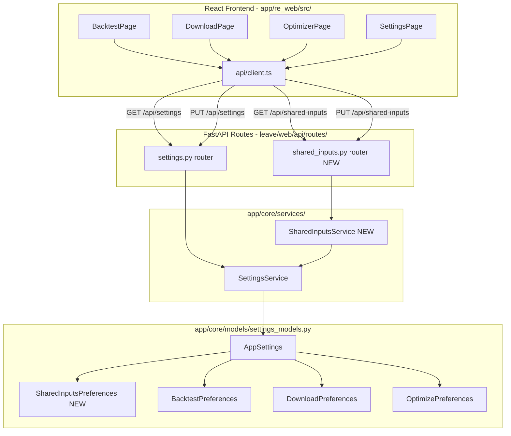

# Design Document: Shared Inputs

## Overview

The `shared-inputs` feature consolidates six common trading input fields — `default_timeframe`, `default_timerange`, `last_timerange_preset`, `default_pairs`, `dry_run_wallet`, and `max_open_trades` — into a single canonical preference section (`shared_inputs`) in `AppSettings`. Currently these fields are stored independently in `backtest_preferences`, `download_preferences`, and `optimizer_preferences`, causing values to diverge across pages.

The design introduces:
- A new `SharedInputsPreferences` Pydantic model and `shared_inputs` field on `AppSettings` with a migration validator
- A `SharedInputsService` backend service wrapping `SettingsService`
- Two new REST endpoints (`GET /api/shared-inputs`, `PUT /api/shared-inputs`)
- Updated `GET /api/settings` response to include `shared_inputs`
- A `SharedInputsConfig` TypeScript interface and two new API client methods
- Updated `BacktestPage`, `DownloadPage`, and `OptimizerPage` to read/write from `shared_inputs`
- Removal of the three `PrefsSection` blocks from `SettingsPage`

The existing per-section fields are retained for backward compatibility with existing `settings.json` files; a `model_validator` migrates them on first load.

---

## Architecture



**Data flow for a shared field update:**
1. User edits a field on any page (e.g. `default_timeframe` on `BacktestPage`)
2. `useAutosave` debounces and calls `api.updateSharedInputs({ default_timeframe: "1h" })`
3. `PUT /api/shared-inputs` delegates to `SharedInputsService.write_config()`
4. `SharedInputsService` validates, resolves preset if needed, deduplicates pairs, then calls `SettingsService.update_preferences("shared_inputs", ...)`
5. `SettingsService` merges the update into `AppSettings.shared_inputs` and atomically writes `settings.json`
6. The updated `SharedInputsPreferences` is returned up the chain to the frontend

---

## Components and Interfaces

### Backend

#### `SharedInputsPreferences` (new Pydantic model in `app/core/models/settings_models.py`)

```python
class SharedInputsPreferences(BaseModel):
    default_timeframe: str = Field("5m", ...)
    default_timerange: str = Field("", ...)
    last_timerange_preset: str = Field("30d", ...)
    default_pairs: str = Field("", ...)
    dry_run_wallet: float = Field(80.0, ...)
    max_open_trades: int = Field(2, ...)
```

Exactly six fields, no others.

#### `AppSettings` changes

- Add `shared_inputs: SharedInputsPreferences = Field(default_factory=SharedInputsPreferences)`
- Add `model_validator(mode="before")` `migrate_shared_inputs` that runs when `shared_inputs` key is absent from the raw dict, reading from `optimizer_preferences` > `backtest_preferences` > `download_preferences` (priority order: later sources override earlier ones, so optimizer wins)

#### `SettingsService` changes

- Add `"shared_inputs"` to `_PREFERENCE_SECTIONS` frozenset so `update_preferences("shared_inputs", ...)` is accepted

#### `SharedInputsService` (new file `app/core/services/shared_inputs_service.py`)

```python
class SharedInputsService:
    def __init__(self, settings_service: SettingsService) -> None: ...
    def read_config(self) -> SharedInputsPreferences: ...
    def write_config(self, update: SharedInputsUpdate) -> SharedInputsPreferences: ...
```

`SharedInputsUpdate` is a Pydantic model with all six fields as `Optional`.

Validation in `write_config`:
- `dry_run_wallet <= 0` → `ValueError`
- `max_open_trades < 1` → `ValueError`
- `last_timerange_preset` in `KNOWN_PRESETS` → resolve to `YYYYMMDD-YYYYMMDD` and overwrite `default_timerange` (reuses `InputHolderService.resolve_preset` static method)
- `default_pairs` → deduplicate (reuses `InputHolderService.deduplicate_pairs` static method)

#### New route file `leave/web/api/routes/shared_inputs.py`

```
GET  /api/shared-inputs  → SharedInputsService.read_config()
PUT  /api/shared-inputs  → SharedInputsService.write_config(update)
```

Registered in `leave/web/main.py` alongside existing routers.

#### `leave/web/api/routes/settings.py` changes

- `_settings_response()` helper includes `shared_inputs=app_settings.shared_inputs.model_dump(mode="json")`
- `SettingsResponse` model gains `shared_inputs: Dict[str, Any]`

### Frontend

#### `app/re_web/src/types/api.ts` changes

```typescript
export interface SharedInputsConfig {
  default_timeframe: string;
  default_timerange: string;
  last_timerange_preset: string;
  default_pairs: string;
  dry_run_wallet: number;
  max_open_trades: number;
}
```

`SettingsResponse` gains `shared_inputs: SharedInputsConfig`.

#### `app/re_web/src/api/client.ts` changes

```typescript
getSharedInputs: () => request<SharedInputsConfig>('/api/shared-inputs'),
updateSharedInputs: (payload: Partial<SharedInputsConfig>) =>
  request<SharedInputsConfig>('/api/shared-inputs', {
    method: 'PUT',
    body: JSON.stringify(payload),
  }),
```

#### `BacktestPage.tsx` changes

- On mount: read shared fields from `settings.shared_inputs` instead of `settings.backtest_preferences`
- `useAutosave` target: `api.updateSharedInputs(sharedFields)` for the six shared fields; `api.updateSettings({ backtest_preferences: { last_strategy } })` for `last_strategy` only
- No reads/writes to `backtest_preferences` for shared fields

#### `DownloadPage.tsx` changes

- On mount: read `default_timeframe`, `default_timerange`, `default_pairs` from `settings.shared_inputs`
- `useAutosave` target: `api.updateSharedInputs(...)` for those three fields; `api.updateSettings({ download_preferences: { prepend, erase } })` for download-only fields
- No reads/writes to `download_preferences` for shared fields

#### `OptimizerPage.tsx` changes

- On mount: call `api.getSharedInputs()` (or read from `settings.shared_inputs`) for the six shared fields; keep `last_strategy` from `api.getOptimizerConfig()`
- `useAutosave` splits: shared fields → `api.updateSharedInputs(...)`; `last_strategy` → `api.updateOptimizerConfig({ last_strategy })`
- No reads/writes to `optimizer_preferences` for shared fields

#### `SettingsPage.tsx` changes

- Remove the three `<PrefsSection>` calls for `backtest_preferences`, `optimizer_preferences`, `download_preferences`
- Keep only the "Paths & Executables" section
- `useAutosave` only persists path/executable fields

---

## Data Models

### `SharedInputsPreferences` (Python)

| Field | Type | Default | Constraint |
|---|---|---|---|
| `default_timeframe` | `str` | `"5m"` | — |
| `default_timerange` | `str` | `""` | — |
| `last_timerange_preset` | `str` | `"30d"` | — |
| `default_pairs` | `str` | `""` | comma-separated, deduplicated on write |
| `dry_run_wallet` | `float` | `80.0` | > 0 |
| `max_open_trades` | `int` | `2` | >= 1 |

### `SharedInputsUpdate` (Python, for PUT body)

All six fields as `Optional[T] = None`.

### `SharedInputsConfig` (TypeScript)

```typescript
interface SharedInputsConfig {
  default_timeframe: string;
  default_timerange: string;
  last_timerange_preset: string;
  default_pairs: string;
  dry_run_wallet: number;
  max_open_trades: number;
}
```

### Migration logic in `AppSettings.migrate_shared_inputs`

```
if "shared_inputs" not in raw_data:
    merged = {}
    for source in ["download_preferences", "backtest_preferences", "optimizer_preferences"]:
        section = raw_data.get(source, {})
        for field in SIX_SHARED_FIELDS:
            if field in section:
                merged[field] = section[field]
    raw_data["shared_inputs"] = merged  # optimizer wins (last applied)
```

Priority: `optimizer_preferences` > `backtest_preferences` > `download_preferences` (last-write-wins over the three sources).

---

## Correctness Properties

*A property is a characteristic or behavior that should hold true across all valid executions of a system — essentially, a formal statement about what the system should do. Properties serve as the bridge between human-readable specifications and machine-verifiable correctness guarantees.*

This feature has testable correctness properties in the backend service layer (pure Python logic: migration, validation, preset resolution, deduplication). Property-based testing is applied using **Hypothesis**.

### Property Reflection

After prework analysis, the following consolidations were made:
- Properties 2.1 and 2.2 (read_config round-trip and write_config persistence) are combined into a single write/read round-trip property.
- Properties 2.3 and 2.4 (validation errors for dry_run_wallet and max_open_trades) are combined into a single validation property covering both numeric constraints.
- Property 9.1 (last-write-wins across pages) is subsumed by the write/read round-trip property (2.1/2.2 combined).

### Property 1: Migration priority is respected

*For any* combination of `optimizer_preferences`, `backtest_preferences`, and `download_preferences` dicts that each contain a subset of the six shared fields, constructing `AppSettings` without a `shared_inputs` key SHALL produce `shared_inputs` values that match `optimizer_preferences` where present, then `backtest_preferences`, then `download_preferences` as fallback.

**Validates: Requirements 1.3**

### Property 2: Write/read round-trip preserves values

*For any* valid `SharedInputsUpdate` (with `dry_run_wallet > 0` and `max_open_trades >= 1`), calling `SharedInputsService.write_config(update)` followed by `SharedInputsService.read_config()` SHALL return a `SharedInputsPreferences` whose fields match the written values (after preset resolution and pair deduplication are applied).

**Validates: Requirements 2.1, 2.2, 9.1**

### Property 3: Numeric validation rejects invalid inputs

*For any* `dry_run_wallet <= 0` or `max_open_trades < 1`, calling `SharedInputsService.write_config()` with that value SHALL raise a `ValueError` and SHALL NOT modify the persisted settings.

**Validates: Requirements 2.3, 2.4**

### Property 4: Preset resolution produces valid YYYYMMDD-YYYYMMDD timerange

*For any* known preset key (e.g. `"7d"`, `"30d"`, `"1y"`), calling `SharedInputsService.write_config({ last_timerange_preset: key })` SHALL set `default_timerange` to a string matching the pattern `YYYYMMDD-YYYYMMDD` where the end date is today and the start date is `days_for_preset` days before today.

**Validates: Requirements 2.5**

### Property 5: Pair deduplication preserves insertion order and removes duplicates

*For any* comma-separated pairs string (including strings with repeated entries), calling `SharedInputsService.write_config({ default_pairs: pairs_str })` SHALL persist a `default_pairs` value where each pair appears at most once and the relative order of first occurrences is preserved.

**Validates: Requirements 2.6**

---

## Error Handling

| Scenario | Layer | Response |
|---|---|---|
| `dry_run_wallet <= 0` | `SharedInputsService` | `ValueError` → HTTP 422 |
| `max_open_trades < 1` | `SharedInputsService` | `ValueError` → HTTP 422 |
| Disk write failure | `SettingsService` | `RuntimeError` → HTTP 500 |
| Unknown preference section | `SettingsService` | `ValueError` → HTTP 422 |
| Frontend fetch error | `api/client.ts` `ApiError` | Surfaced to calling page via thrown `ApiError` |

The `ApiError` class in `client.ts` already captures `status`, `message`, and `detail`. Pages should catch `ApiError` and display the `message` to the user (consistent with existing error handling patterns in `OptimizerPage` and `BacktestPage`).

---

## Testing Strategy

### Unit tests (Python — `pytest` + `hypothesis`)

**Property-based tests** (minimum 100 iterations each, tagged with feature/property reference):

- `test_migration_priority` — Property 1: generate random combinations of source section dicts, verify migration priority
- `test_write_read_roundtrip` — Property 2: generate valid `SharedInputsUpdate` instances, verify round-trip
- `test_numeric_validation_rejects_invalid` — Property 3: generate invalid numeric values, verify `ValueError` and no state change
- `test_preset_resolution_format` — Property 4: parametrize over all known preset keys, verify `YYYYMMDD-YYYYMMDD` format
- `test_pair_deduplication_order` — Property 5: generate strings with duplicates, verify deduplication and order

**Example-based unit tests:**

- `test_shared_inputs_defaults` — Req 1.1: `AppSettings()` has correct defaults
- `test_shared_inputs_fields_only` — Req 1.2: `SharedInputsPreferences` has exactly six fields
- `test_legacy_fields_retained` — Req 1.4: existing preference models still have shared fields
- `test_api_422_on_invalid_wallet` — Req 3.3: `PUT /api/shared-inputs` with `dry_run_wallet=0` returns 422
- `test_settings_response_includes_shared_inputs` — Req 3.4: `GET /api/settings` includes `shared_inputs`

### Integration tests (Python)

- `test_get_shared_inputs_endpoint` — Req 3.1: `GET /api/shared-inputs` returns 200 with correct shape
- `test_put_shared_inputs_endpoint` — Req 3.2: `PUT /api/shared-inputs` with partial body returns updated state

### Frontend tests (TypeScript — `vitest`)

- `SettingsPage` renders without `PrefsSection` for the three removed sections — Req 8.1
- `BacktestPage` calls `api.updateSharedInputs` (not `api.updateSettings` with `backtest_preferences`) on field change — Req 5.2
- `DownloadPage` calls `api.updateSharedInputs` on shared field change — Req 6.2
- `OptimizerPage` calls `api.updateSharedInputs` for shared fields and `api.updateOptimizerConfig` for `last_strategy` — Req 7.2, 7.3

PBT is not applied to the frontend layer (UI rendering, React component state) — example-based component tests are appropriate there.
