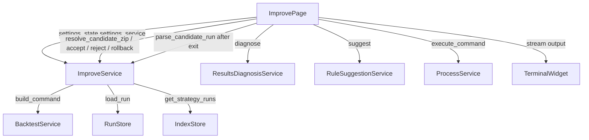

# Design Document: Strategy Improve

## Overview

The Strategy Improve feature adds an "Improve" tab to the Freqtrade GUI, positioned between the Backtest and Optimize tabs. It implements a closed-loop improvement workflow: load a saved backtest run → diagnose performance issues via rule-based heuristics → generate concrete parameter-change suggestions → apply suggestions to an in-memory candidate config → run a sandboxed backtest → compare results side-by-side → accept or reject.

All diagnosis and suggestion logic is rule-based and stateless. No AI or external services are involved. The feature reuses all existing infrastructure: `BacktestService`, `ProcessService`, `RunStore`, `IndexStore`, `TerminalWidget`, and `SettingsState`.

---

## Architecture

The feature follows the existing layered architecture strictly:

```
UI Layer        app/ui/pages/improve_page.py
                    ↓ holds SettingsState, owns ProcessService + TerminalWidget
                    ↓ calls ImproveService for data/file ops only
Service Layer   app/core/services/improve_service.py        (data loading, sandbox prep, file I/O)
                app/core/services/results_diagnosis_service.py  (stateless, @staticmethod)
                app/core/services/rule_suggestion_service.py    (stateless, @staticmethod)
                    ↓ delegates to existing infrastructure
Infra Layer     BacktestService, RunStore, IndexStore, ProcessService, parse_backtest_zip
```



### Key Design Decisions

1. **Sandbox isolation**: Each candidate run gets its own subdirectory `{user_data_path}/strategies/_improve_sandbox/{strategy_name}_{timestamp}/`. The strategy `.py` is copied in and the candidate `{strategy_name}.json` is written there. `--strategy-path {sandbox_dir}` is passed as an extra flag so Freqtrade loads both from the sandbox without touching the live strategy file.

2. **Params loaded separately**: `params.json` is read directly from the run folder as a plain `dict` (`BaselineParams`). It is not part of `RunStore.load_run()` which only reconstructs `BacktestResults`.

3. **Rollback is params-only**: `_baseline_history` stores `BaselineParams` snapshots (plain dicts). There is no `BaselineRun` rollback — the user re-analyzes if they want updated metrics after a rollback.

4. **Zip resolution**: `build_candidate_command()` passes `--backtest-directory {export_dir}` (the supported flag; `--export-filename` is deprecated) pointing to a deterministic per-candidate directory `{user_data_path}/backtest_results/_improve/{strategy_name}_{timestamp}/`. After the process exits with code 0, `resolve_candidate_zip()` reads the single `.zip` from that directory directly. No mtime scanning or race-condition risk. Fallback to mtime-based scan is only used if the export directory is empty.

5. **Service coupling**: `ImproveService` accepts `SettingsService` + `BacktestService`. `ImprovePage` passes `settings_state.settings_service` when constructing `ImproveService`.

---

## Components and Interfaces

### New Files

| File | Role |
|------|------|
| `app/ui/pages/improve_page.py` | `ImprovePage(QWidget)` — full UI, thin orchestration |
| `app/core/services/improve_service.py` | `ImproveService` — sandbox prep, zip resolution + parsing, accept/reject/rollback |
| `app/core/services/results_diagnosis_service.py` | `ResultsDiagnosisService` — stateless rule evaluation |
| `app/core/services/rule_suggestion_service.py` | `RuleSuggestionService` — stateless issue→suggestion mapping |
| `app/core/models/improve_models.py` | `DiagnosedIssue`, `ParameterSuggestion` dataclasses |

### Modified Files

| File | Change |
|------|--------|
| `app/ui/main_window.py` | Insert `ImprovePage` tab after Backtest, before Optimize |

---

### `improve_models.py`

```python
@dataclass
class DiagnosedIssue:
    issue_id: str          # e.g. "stoploss_too_wide"
    description: str       # human-readable

@dataclass
class ParameterSuggestion:
    parameter: str         # e.g. "stoploss", "max_open_trades", "minimal_roi"
    proposed_value: Any    # None for advisory-only
    reason: str
    expected_effect: str
    is_advisory: bool = False
```

### `ResultsDiagnosisService`

```python
class ResultsDiagnosisService:
    @staticmethod
    def diagnose(summary: BacktestSummary) -> List[DiagnosedIssue]: ...
```

Rules (all thresholds are constants at module level):

| Issue ID | Condition |
|----------|-----------|
| `stoploss_too_wide` | `summary.max_drawdown > 20.0` |
| `trades_too_low` | `summary.total_trades < 30` |
| `weak_win_rate` | `summary.win_rate < 45.0` |
| `drawdown_high` | `summary.max_drawdown > 30.0` |
| `poor_pair_concentration` | `len(summary.pairlist) < 3` |
| `negative_profit` | `summary.total_profit < 0.0` |

### `RuleSuggestionService`

```python
class RuleSuggestionService:
    @staticmethod
    def suggest(issues: List[DiagnosedIssue], params: dict) -> List[ParameterSuggestion]: ...
```

`params` is the `BaselineParams` dict (`buy_params`, `sell_params`, `minimal_roi`, `stoploss`, `max_open_trades`).

### `ImproveService`

`ImproveService` is responsible **only** for data preparation and file I/O. It does **not** own `ProcessService` or interact with the terminal. All subprocess execution is handled by `ImprovePage`.

```python
class ImproveService:
    def __init__(self, settings_service: SettingsService, backtest_service: BacktestService): ...

    # Data loading
    def get_available_strategies(self) -> List[str]: ...
    def get_strategy_runs(self, strategy: str) -> List[dict]: ...
    def load_baseline(self, run_dir: Path) -> BacktestResults: ...
    def load_baseline_params(self, run_dir: Path) -> dict: ...

    # Sandbox + command
    def prepare_sandbox(self, strategy_name: str, candidate_config: dict) -> Path: ...
    def build_candidate_command(self, strategy_name: str, baseline: BacktestResults,
                                sandbox_dir: Path) -> BacktestRunCommand: ...

    # Zip resolution + parsing (called by ImprovePage after process exits)
    def resolve_candidate_zip(self, export_dir: Path) -> Optional[Path]: ...
    def parse_candidate_run(self, export_dir: Path) -> BacktestResults: ...

    # Accept / reject / rollback (file I/O only)
    def accept_candidate(self, strategy_name: str, candidate_config: dict) -> None: ...
    def reject_candidate(self, sandbox_dir: Path) -> None: ...
    def rollback(self, strategy_name: str, baseline_params: dict) -> None: ...
```

### `ImprovePage`

`ImprovePage` owns the full subprocess lifecycle and all UI state. It calls `ImproveService` for data and file operations, then drives `ProcessService` and `TerminalWidget` itself.

```python
class ImprovePage(QWidget):
    def __init__(self, settings_state: SettingsState, parent=None): ...
```

Responsibility split:

| `ImproveService` | `ImprovePage` |
|-----------------|---------------|
| `load_baseline()` | Starts `ProcessService` |
| `load_baseline_params()` | Connects terminal output |
| `prepare_sandbox()` | Enable/disable buttons |
| `build_candidate_command()` | Handles `on_finished` signal |
| `resolve_candidate_zip()` + `parse_candidate_run()` | Calls `ImproveService.parse_candidate_run(export_dir)` after exit |
| `accept_candidate()` | Triggers comparison view update |
| `reject_candidate()` | Manages `_baseline_history` stack |
| `rollback()` | Displays status messages |

Internal state:
- `_baseline_run: Optional[BacktestResults]`
- `_baseline_params: Optional[dict]`  — loaded from `params.json`
- `_candidate_config: dict`  — in-memory, starts as copy of `_baseline_params`
- `_candidate_run: Optional[BacktestResults]`
- `_baseline_history: List[dict]`  — stack of `BaselineParams` snapshots
- `_sandbox_dir: Optional[Path]`
- `_run_started_at: float`

---

## Data Models

### `BaselineParams` (plain `dict`)

Loaded from `{run_dir}/params.json`:

```json
{
  "buy_params":  { ... },
  "sell_params": { ... },
  "minimal_roi": { "0": 0.02, "30": 0.01, "60": 0.005 },
  "stoploss":    -0.10,
  "max_open_trades": 3
}
```

`max_open_trades` may be absent in older runs; default to `None` in that case.

### `CandidateConfig` (plain `dict`)

Same shape as `BaselineParams`. Starts as a deep copy of `BaselineParams`. Suggestions mutate specific keys. The diff shown in the UI is computed as:

```python
diff = {k: v for k, v in candidate_config.items() if v != baseline_params.get(k)}
```

### Sandbox Layout

```
{user_data_path}/strategies/_improve_sandbox/
└── {strategy_name}_{YYYYMMDD_HHMMSS}/
    ├── {strategy_name}.py      # copied from strategies/
    └── {strategy_name}.json    # written from CandidateConfig
```

### Candidate Export Directory

Each candidate run writes its backtest zip to a dedicated directory passed via `--backtest-directory`:

```
{user_data_path}/backtest_results/_improve/
└── {strategy_name}_{YYYYMMDD_HHMMSS}/
    └── backtest-result-*.zip   # single zip written by Freqtrade
```

`resolve_candidate_zip(export_dir)` reads the single `.zip` from `export_dir`. If the directory is empty, it falls back to the most recently modified `.zip` in `{user_data_path}/backtest_results/` with `mtime >= process_start_timestamp`.

---

## Correctness Properties

*A property is a characteristic or behavior that should hold true across all valid executions of a system — essentially, a formal statement about what the system should do. Properties serve as the bridge between human-readable specifications and machine-verifiable correctness guarantees.*

**Property reflection**: After reviewing all testable criteria, the following consolidations apply:
- 4.2–4.7 (individual diagnosis thresholds) are all instances of the same pattern: "for any summary where condition X holds, issue Y is in the output." These can be expressed as a single parametric property covering all rules.
- 8.3 and 8.4 (green/red highlighting) are two sides of the same comparison logic and can be combined into one property.
- 3.2 and 8.1/8.2 (display fields) are each about rendering completeness and remain separate since they cover different data.
- 5.2, 5.3, 5.4, 5.5, 5.7 (individual suggestion rules) are all instances of the same pattern and can be expressed as a single parametric property.

---

### Property 1: Diagnosis threshold rules are exhaustive and correct

*For any* `BacktestSummary`, `ResultsDiagnosisService.diagnose()` SHALL include `"stoploss_too_wide"` if and only if `max_drawdown > 20.0`, `"trades_too_low"` if and only if `total_trades < 30`, `"weak_win_rate"` if and only if `win_rate < 45.0`, `"drawdown_high"` if and only if `max_drawdown > 30.0`, `"poor_pair_concentration"` if and only if `len(pairlist) < 3`, and `"negative_profit"` if and only if `total_profit < 0.0`.

**Validates: Requirements 4.1, 4.2, 4.3, 4.4, 4.5, 4.6, 4.7**

---

### Property 2: Suggestion rules produce correct parameter mutations

*For any* `BaselineParams` dict and any `DiagnosedIssue` list, `RuleSuggestionService.suggest()` SHALL produce suggestions such that: for `"stoploss_too_wide"` the suggested stoploss absolute value is reduced by 0.02; for `"trades_too_low"` the suggested `max_open_trades` is `min(current + 1, 10)`; for `"weak_win_rate"` the suggested ROI value at the smallest integer key is reduced by 0.005; for `"drawdown_high"` the suggested `max_open_trades` is `max(current - 1, 1)`; for `"negative_profit"` the suggested stoploss absolute value is reduced by 0.03.

**Validates: Requirements 5.1, 5.2, 5.3, 5.4, 5.5, 5.7**

---

### Property 3: BaselineParams round-trip from params.json

*For any* run folder containing a valid `params.json`, loading it via `ImproveService.load_baseline_params()` and then serializing the result back to JSON SHALL produce a dict equal to the original file contents.

**Validates: Requirements 3.5**

---

### Property 4: CandidateConfig diff contains exactly the changed keys

*For any* `BaselineParams` dict and any sequence of applied `ParameterSuggestion` objects (excluding advisory-only), the computed diff between `CandidateConfig` and `BaselineParams` SHALL contain exactly the keys whose values were changed by the applied suggestions, and no other keys.

**Validates: Requirements 6.1, 6.2**

---

### Property 5: Reset candidate restores to baseline

*For any* `BaselineParams` and any sequence of applied suggestions, after clicking "Reset Candidate" the `CandidateConfig` SHALL be equal to the original `BaselineParams` snapshot.

**Validates: Requirements 6.4**

---

### Property 6: Comparison metric direction determines highlight color

*For any* pair of `BacktestResults` (baseline and candidate), for each of the 7 comparison metrics, the candidate cell SHALL be highlighted green if the candidate value is strictly better than the baseline value, red if strictly worse, and uncolored if equal. "Better" means: higher for `win_rate`, `total_profit`, `sharpe_ratio`, `profit_factor`, `expectancy`, `total_trades`; lower for `max_drawdown`.

**Validates: Requirements 8.1, 8.2, 8.3, 8.4**

---

### Property 7: Baseline history stack invariant

*For any* sequence of Accept and Rollback operations, the length of `_baseline_history` SHALL increase by 1 on each Accept and decrease by 1 on each Rollback, and after a Rollback the restored `BaselineParams` SHALL equal the most recently pushed snapshot.

**Validates: Requirements 9.8**

---

### Property 8: Run selector entries contain required display fields

*For any* strategy with N saved runs in the index, the run selector combo SHALL display exactly N entries, each containing the run ID, profit percentage, trade count, and saved timestamp.

**Validates: Requirements 2.2**

---

## Error Handling

| Scenario | Handling |
|----------|----------|
| `RunStore.load_run()` raises `FileNotFoundError` or `ValueError` | Display error message in UI; do not update `_baseline_run` |
| `params.json` missing from run folder | Log warning; `_baseline_params` defaults to `{}` |
| Strategy `.py` file not found when preparing sandbox | Raise `FileNotFoundError`; display error in UI |
| Candidate backtest exits non-zero | Display "Candidate backtest failed — see terminal output"; do not update `_candidate_run` |
| No zip found after candidate run | Display warning; do not update `_candidate_run` |
| Atomic write failure on Accept/Rollback | Catch `OSError`; display error dialog; do not corrupt existing file |
| `settings.user_data_path` not configured | Disable "Analyze" button; show hint label |

All service-layer errors use `ValueError` for logic errors and `FileNotFoundError` for missing files. The UI catches these and displays them without crashing.

---

## Testing Strategy

### Unit Tests (example-based)

- `TestResultsDiagnosisService`: one test per rule, testing both sides of each threshold (e.g. `max_drawdown=20.0` → no issue, `max_drawdown=20.1` → issue present).
- `TestRuleSuggestionService`: one test per issue type, verifying the exact parameter mutation and metadata fields.
- `TestImproveService.test_load_baseline_params`: verify dict matches file contents.
- `TestImproveService.test_prepare_sandbox`: verify directory structure and file contents.
- `TestImproveService.test_accept_candidate_atomic_write`: verify `.tmp` → `os.replace()` pattern.
- `TestImproveService.test_reject_candidate_cleanup`: verify sandbox files deleted, main param file untouched.
- `TestImproveService.test_rollback`: verify correct snapshot restored.
- `TestImprovePage` (with mocked services): tab insertion order, strategy selector refresh on `settings_changed`, "No saved runs" state, advisory suggestion marked applied without diff entry.

### Property-Based Tests (Hypothesis)

Property tests use `hypothesis` (already present in the project via `.hypothesis/`). Each test runs a minimum of 100 iterations.

**Feature: strategy-improve, Property 1: Diagnosis threshold rules are exhaustive and correct**
```python
@given(st.builds(BacktestSummary, ...))
@settings(max_examples=200)
def test_diagnosis_thresholds(summary):
    issues = ResultsDiagnosisService.diagnose(summary)
    issue_ids = {i.issue_id for i in issues}
    assert ("stoploss_too_wide" in issue_ids) == (summary.max_drawdown > 20.0)
    assert ("trades_too_low" in issue_ids) == (summary.total_trades < 30)
    assert ("weak_win_rate" in issue_ids) == (summary.win_rate < 45.0)
    assert ("drawdown_high" in issue_ids) == (summary.max_drawdown > 30.0)
    assert ("poor_pair_concentration" in issue_ids) == (len(summary.pairlist) < 3)
    assert ("negative_profit" in issue_ids) == (summary.total_profit < 0.0)
```

**Feature: strategy-improve, Property 2: Suggestion rules produce correct parameter mutations**
```python
@given(params=st.fixed_dictionaries({...}), issues=st.lists(st.sampled_from([...]), min_size=1))
@settings(max_examples=200)
def test_suggestion_mutations(params, issues):
    suggestions = RuleSuggestionService.suggest(issues, params)
    # verify each suggestion's proposed_value matches the rule formula
```

**Feature: strategy-improve, Property 3: BaselineParams round-trip**
```python
@given(params=st.fixed_dictionaries({...}))
@settings(max_examples=100)
def test_params_round_trip(params, tmp_path):
    (tmp_path / "params.json").write_text(json.dumps(params))
    loaded = ImproveService(settings_service, backtest_service).load_baseline_params(tmp_path)
    assert loaded == params
```

**Feature: strategy-improve, Property 4: CandidateConfig diff contains exactly changed keys**
```python
@given(baseline=..., suggestions=...)
@settings(max_examples=200)
def test_candidate_diff_exact(baseline, suggestions):
    candidate = apply_suggestions(baseline, suggestions)
    diff = compute_diff(baseline, candidate)
    changed_keys = {s.parameter for s in suggestions if not s.is_advisory}
    assert set(diff.keys()) == changed_keys
```

**Feature: strategy-improve, Property 5: Reset candidate restores to baseline**
```python
@given(baseline=..., suggestions=...)
@settings(max_examples=100)
def test_reset_restores_baseline(baseline, suggestions):
    candidate = apply_suggestions(baseline, suggestions)
    reset = reset_candidate(baseline)
    assert reset == baseline
```

**Feature: strategy-improve, Property 6: Comparison metric direction determines highlight color**
```python
@given(baseline_val=st.floats(...), candidate_val=st.floats(...), metric=st.sampled_from(METRICS))
@settings(max_examples=200)
def test_comparison_highlight(baseline_val, candidate_val, metric):
    color = compute_highlight(metric, baseline_val, candidate_val)
    if is_higher_better(metric):
        expected = GREEN if candidate_val > baseline_val else (RED if candidate_val < baseline_val else None)
    else:
        expected = GREEN if candidate_val < baseline_val else (RED if candidate_val > baseline_val else None)
    assert color == expected
```

**Feature: strategy-improve, Property 7: Baseline history stack invariant**
```python
@given(ops=st.lists(st.sampled_from(["accept", "rollback"]), min_size=1, max_size=20))
@settings(max_examples=100)
def test_history_stack_invariant(ops):
    history = []
    current = {"stoploss": -0.10}
    for op in ops:
        if op == "accept":
            history.append(copy.deepcopy(current))
            current = mutate(current)
        elif op == "rollback" and history:
            prev = history.pop()
            assert prev is not None
    assert len(history) >= 0
```

**Feature: strategy-improve, Property 8: Run selector entries contain required display fields**
```python
@given(runs=st.lists(st.fixed_dictionaries({...}), min_size=0, max_size=20))
@settings(max_examples=100)
def test_run_selector_entries(runs):
    labels = build_run_labels(runs)
    assert len(labels) == len(runs)
    for label, run in zip(labels, runs):
        assert run["run_id"] in label
        assert str(run["profit_total_pct"]) in label or f"{run['profit_total_pct']}" in label
```
