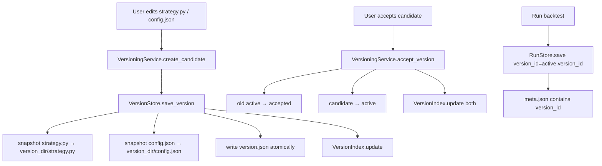

# Design Document — Strategy Versioning

## Overview

نظام إدارة نسخ الاستراتيجيات يضيف طبقة تتبع للتغييرات فوق البنية الحالية لـ `backtest_results`. كل تعديل على ملف استراتيجية (`.py`) أو ملف إعداداتها (`.json`) يُنشئ **candidate version** تحتوي على snapshot لكلا الملفين. يمكن قبول النسخة (`active`) أو رفضها (`rejected`)، وكل backtest run يُربط بالنسخة التي شغّلته عبر `version_id` في `meta.json`.

النظام يتبع نفس أنماط `RunStore` / `IndexStore` الموجودة: مجلدات على القرص + ملف `index.json` لكل استراتيجية + كتابة ذرية عبر temp file + rename.

---

## Architecture

```
VersioningService          ← طبقة الخدمة (stateful, accepts SettingsService)
    │
    ├── VersionStore       ← حفظ/تحميل نسخة واحدة (static methods)
    │       writes: {user_data}/strategy_versions/{strategy}/{version_id}/
    │               ├── strategy.py      (snapshot)
    │               ├── config.json      (snapshot)
    │               └── version.json     (metadata)
    │
    └── VersionIndex       ← فهرس النسخ لكل استراتيجية (static methods)
            reads/writes: {user_data}/strategy_versions/{strategy}/index.json
```

### تكامل مع البنية الحالية

```
BacktestService.build_command()
    └── RunStore.save(..., version_id=...)
            ├── _write_meta()  ← يكتب "version_id" في meta.json
            ├── IndexStore.update()   ← يضيف version_id للـ entry
            └── StrategyIndexStore.update()
```



---

## Components and Interfaces

### `VersionStatus` / `VersionSource` enums — `app/core/versioning/version_models.py`

```python
class VersionStatus(str, Enum):
    ACTIVE    = "active"
    CANDIDATE = "candidate"
    ACCEPTED  = "accepted"
    REJECTED  = "rejected"

class VersionSource(str, Enum):
    MANUAL_EDIT        = "manual_edit"
    OPTIMIZE           = "optimize"
    AI_CANDIDATE       = "ai_candidate_future"
    RULE_BASED         = "rule_based_future"
```

`str` mixin يجعل القيم قابلة للتسلسل مباشرة في JSON بدون تحويل إضافي.

---

### `StrategyVersion` (dataclass — `app/core/versioning/version_models.py`)

الـ DTO الأساسي. يُستخدم داخلياً في كل طبقات النظام. مصمم ليحمل كل ما يُحتاج لاحقاً بدون ترقيع.

```python
@dataclass
class StrategyVersion:
    # --- Identity ---
    version_id: str                   # UUID string
    strategy_name: str
    base_version_id: Optional[str]    # None للنسخة الأولى

    # --- State ---
    status: VersionStatus             # active | candidate | accepted | rejected
    source_type: VersionSource        # manual_edit | optimize | ...

    # --- Live file paths (الملفات الفعلية في user_data/strategies/) ---
    strategy_file_path: str           # المسار الفعلي لـ strategy.py
    live_params_path: str             # المسار الفعلي لـ MyStrategy.json داخل user_data/strategies/

    # --- Snapshot paths (داخل version_dir) ---
    snapshot_strategy_path: str       # {version_dir}/strategy.py
    snapshot_params_path: str         # {version_dir}/strategy_params.json

    # --- Timestamps ---
    created_at: str                   # ISO-8601
    updated_at: str                   # ISO-8601 — يُحدَّث عند كل تغيير status

    # --- Optional / future ---
    notes: Optional[str] = None
    last_run_id: Optional[str] = None      # آخر run_id شغّل هذه النسخة
    diff_summary: Optional[str] = None    # ملخص نصي للفرق عن base_version (للعرض لاحقاً)
```

**Serialization helpers** (module-level functions):
- `version_to_dict(v: StrategyVersion) -> dict`
- `version_from_dict(d: dict) -> StrategyVersion`

### `VersionStore` (static methods — `app/core/versioning/version_store.py`)

```python
class VersionStore:
    @staticmethod
    def save_version(
        version: StrategyVersion,
        strategy_py_path: Path,
        strategy_params_path: Path,    # MyStrategy.json داخل user_data/strategies/
        versions_root: Path,
    ) -> Path:
        """Copy snapshots + write version.json atomically. Returns version_dir."""

    @staticmethod
    def load_version(version_dir: Path) -> StrategyVersion:
        """Load StrategyVersion from version.json. Raises FileNotFoundError / ValueError."""

    @staticmethod
    def update_status(version_dir: Path, new_status: str) -> None:
        """Rewrite version.json with updated status (atomic)."""
```

### `VersionIndex` (static methods — `app/core/versioning/version_index.py`)

```python
class VersionIndex:
    @staticmethod
    def update(strategy_versions_dir: Path, version: StrategyVersion) -> None:
        """Upsert version entry in index.json."""

    @staticmethod
    def load(strategy_versions_dir: Path) -> List[StrategyVersion]:
        """Load all versions sorted by created_at descending. Returns [] if missing."""

    @staticmethod
    def rebuild(strategy_versions_dir: Path, strategy_name: str) -> List[StrategyVersion]:
        """Scan version dirs, reconstruct from version.json files, rewrite index."""
```

### `VersioningService` (stateful — `app/core/versioning/versioning_service.py`)

```python
class VersioningService:
    def __init__(self, settings_service: SettingsService): ...

    def create_candidate(
        self,
        strategy_name: str,
        strategy_py_path: Path,
        strategy_params_path: Path,    # MyStrategy.json — ليس config.json العام
        source_type: str = "manual_edit",
        notes: Optional[str] = None,
    ) -> StrategyVersion: ...

    def accept_version(self, version_id: str) -> StrategyVersion:
        """
        الخطوات — كلها تتم بترتيب آمن ذري:
        1. نسخ snapshot_strategy_path → strategy_file_path عبر temp file + replace
        2. نسخ snapshot_params_path → live_params_path عبر temp file + replace
        3. بعد نجاح النسخ فقط: نقل الـ active السابق → accepted + تحديث updated_at
        4. تحويل الـ candidate → active + ضبط base_version_id + تحديث updated_at
        5. تحديث الفهرس لكلا النسختين

        الترتيب مقصود: الملفات الحية تُكتب أولاً قبل تغيير الحالة في الفهرس،
        حتى لا ينتهي الحال بـ active في الفهرس بينما الملف الحي انقطع نصف كتابة.
        """

    def reject_version(self, version_id: str) -> StrategyVersion: ...

    def get_active_version(self, strategy_name: str) -> Optional[StrategyVersion]: ...

    def list_versions(self, strategy_name: str) -> List[StrategyVersion]: ...

    def get_version(self, version_id: str) -> Optional[StrategyVersion]: ...

    def get_version_for_run(self, run_meta: dict) -> Optional[StrategyVersion]:
        """
        Source of truth: run_meta["version_id"] من meta.json.
        الفهرس cache فقط — القراءة الفعلية من version.json على القرص.
        يُرجع None إذا لم يوجد version_id أو لم تُوجد النسخة.
        """

    def build_diff_preview(
        self,
        candidate_version_id: str,
    ) -> dict:
        """
        يقارن الملفات الفعلية الحالية في user_data/strategies/ مع snapshots الـ candidate.
        Returns: {"strategy_diff": str, "params_diff": str}
        الـ diff نصي unified format — للاستخدام لاحقاً في UI.
        """

    def _versions_root(self) -> Path: ...
    def _strategy_versions_dir(self, strategy_name: str) -> Path: ...
```

### تعديل `RunStore.save()` (`app/core/backtests/results_store.py`)

إضافة parameter اختياري:

```python
@staticmethod
def save(
    results: BacktestResults,
    strategy_results_dir: str,
    config_path: Optional[str] = None,
    run_params: Optional[dict] = None,
    version_id: Optional[str] = None,   # ← جديد
) -> Path: ...
```

`_write_meta()` تُحدَّث لتكتب `"version_id": version_id` (أو `null`).

---

## Data Models

### هيكل المجلدات على القرص

```
{user_data}/
└── strategy_versions/
    └── {strategy_name}/
        ├── index.json
        └── {version_id}/
            ├── strategy.py           ← snapshot of .py
            ├── strategy_params.json  ← snapshot of MyStrategy.json
            └── version.json
```

### `version.json` — مثال

```json
{
  "version_id": "a1b2c3d4-...",
  "strategy_name": "MyStrategy",
  "base_version_id": null,
  "status": "active",
  "source_type": "manual_edit",
  "strategy_file_path": "/home/user/.../user_data/strategies/MyStrategy.py",
  "live_params_path": "/home/user/.../user_data/strategies/MyStrategy.json",
  "snapshot_strategy_path": "/home/user/.../strategy_versions/MyStrategy/a1b2c3d4-.../strategy.py",
  "snapshot_params_path": "/home/user/.../strategy_versions/MyStrategy/a1b2c3d4-.../strategy_params.json",
  "created_at": "2024-01-15T10:30:00.123456",
  "updated_at": "2024-01-15T10:32:00.000000",
  "notes": null,
  "last_run_id": null,
  "diff_summary": null
}
```

### `index.json` — مثال

```json
{
  "strategy": "MyStrategy",
  "updated_at": "2024-01-15T10:35:00",
  "versions": [
    {
      "version_id": "b2c3d4e5-...",
      "status": "candidate",
      "source_type": "manual_edit",
      "created_at": "2024-01-15T10:35:00",
      "base_version_id": "a1b2c3d4-...",
      "notes": null
    },
    {
      "version_id": "a1b2c3d4-...",
      "status": "active",
      "source_type": "manual_edit",
      "created_at": "2024-01-15T10:30:00",
      "base_version_id": null,
      "notes": null
    }
  ]
}
```

> الـ index يخزن الحقول الخفيفة فقط (بدون `strategy_snapshot_path` و`config_snapshot_path`) لأن هذه المسارات يمكن اشتقاقها من `version_id` عند الحاجة.

### تعديل `meta.json` في `RunStore`

```json
{
  "run_id": "run_2024-01-15_10-40-00_abc123",
  "strategy": "MyStrategy",
  "version_id": "a1b2c3d4-...",
  ...
}
```

---

## Correctness Properties

*A property is a characteristic or behavior that should hold true across all valid executions of a system — essentially, a formal statement about what the system should do. Properties serve as the bridge between human-readable specifications and machine-verifiable correctness guarantees.*

### Property 1: Serialization Round-Trip

*For any* valid `StrategyVersion` object, serializing it to a dict via `version_to_dict` then deserializing via `version_from_dict` SHALL produce an equivalent object with all fields identical.

**Validates: Requirements 1.3, 1.4, 1.5**

---

### Property 2: Index Consistency After Operations

*For any* sequence of `create_candidate`, `accept_version`, and `reject_version` operations on a strategy, the `VersionIndex` SHALL reflect the final status of every version accurately — no version is lost, and each version appears exactly once with its correct status.

**Validates: Requirements 4.2, 4.6**

---

### Property 3: At Most One Active Version Per Strategy

*For any* strategy and *for any* sequence of accept operations, at most one version SHALL hold the `active` status at any point in time.

**Validates: Requirements 3.4**

---

### Property 4: Unique Version IDs

*For any* number of calls to `VersioningService.create_candidate`, all generated `version_id` values SHALL be distinct.

**Validates: Requirements 6.3, 6.4**

---

## Error Handling

| Situation | Behaviour |
|-----------|-----------|
| `strategy.py` not found at given path | `FileNotFoundError` with descriptive message |
| `MyStrategy.json` (params) not found at given path | `FileNotFoundError` with descriptive message |
| `accept_version` called on non-candidate | `ValueError("Version {id} has status '{status}', expected 'candidate'")` |
| `reject_version` called on non-candidate | `ValueError("Version {id} has status '{status}', expected 'candidate'")` |
| Duplicate `version_id` directory exists | `ValueError("Version directory already exists: {path}")` |
| Malformed `version.json` during rebuild | Log warning, skip entry, continue |
| `version_id` in `meta.json` not found | Return `None` (no exception) |
| `index.json` missing | Return `[]` (no exception) |

الكتابة الذرية لـ `version.json`: يُكتب أولاً في `{path}.tmp` ثم يُعاد تسميته إلى المسار النهائي عبر `Path.rename()`.

الكتابة الذرية للملفات الحية في `accept_version`: كل ملف يُنسخ إلى `{target}.tmp` أولاً، ثم `Path.replace(target)` — وهذا يحدث **قبل** أي تغيير في الحالة أو الفهرس. إذا فشل النسخ، تبقى الحالة `candidate` ولا يتغير شيء.

---

## Testing Strategy

### Unit Tests (`tests/core/versioning/`)

- `test_version_models.py` — serialization/deserialization، round-trip، حقول مفقودة
- `test_version_store.py` — `save_version` يُنشئ الملفات الصحيحة، `load_version` يُعيد البناء، `update_status` يكتب ذرياً
- `test_version_index.py` — `load` يُرجع `[]` عند غياب الملف، `update` يُحدّث الفهرس، `rebuild` يُعيد البناء من القرص
- `test_versioning_service.py` — دورة الحياة الكاملة، قبول/رفض، استرجاع النسخة النشطة، ربط الـ run
- `test_run_store_version.py` — `RunStore.save(..., version_id=...)` يكتب الحقل في `meta.json`

### Property-Based Tests (`tests/core/versioning/test_properties.py`)

المكتبة المستخدمة: **Hypothesis** — مضافة صراحةً في `requirements.txt` (انظر task 6.0). لا يُفترض وجودها مسبقاً.

كل property test يعمل بحد أدنى **100 iteration**.

```python
# Tag format: Feature: strategy-versioning, Property {N}: {text}
```

- **Property 1** — `@given(st.builds(StrategyVersion, ...))` → round-trip serialization
- **Property 2** — `@given(st.lists(...))` → index consistency بعد تسلسل عمليات عشوائية
- **Property 3** — `@given(st.integers(min_value=1, max_value=20))` → at-most-one-active invariant
- **Property 4** — `@given(st.integers(min_value=2, max_value=50))` → unique UUIDs

### Integration Tests

- تحقق من أن `RunStore.save(..., version_id="test-id")` يكتب `version_id` في `meta.json` الفعلي على القرص
- تحقق من أن `VersionIndex.rebuild` يُعيد بناء الفهرس بشكل صحيح من مجلدات حقيقية
