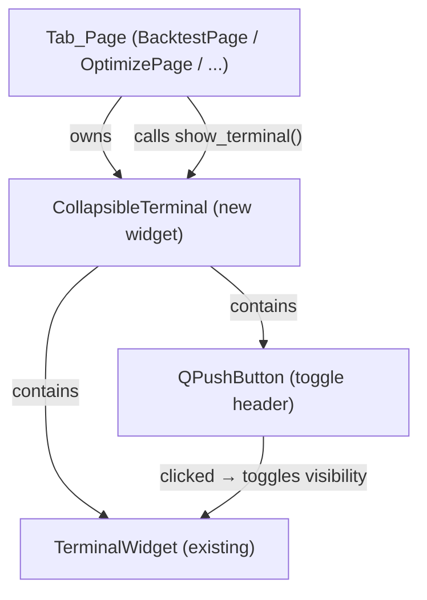

# Design Document: Tab Layout Redesign

## Overview

This redesign fixes content overflow and clipping issues across all Tab_Pages in the Freqtrade GUI. The changes are purely structural — no business logic, service layer, or data models change. The work falls into three categories:

1. **Params panel hardening** — every page's left panel is wrapped in a `QScrollArea` with horizontal scrolling disabled and explicit min/max widths, so controls never clip at minimum window size.
2. **Terminal toggle** — a collapsible `QPushButton` header is added above each page's `TerminalWidget`. The terminal is hidden by default; it auto-expands when a subprocess starts.
3. **Optimize page sub-sections** — the flat list of controls on `OptimizePage` is reorganised into labelled `QGroupBox` sub-sections.

The minimum window size is tightened from 1200×800 to 800×600 in `MainWindow`.

---

## Architecture

All changes are confined to the UI layer. No service, model, or state classes are modified.

```
UI Layer (modified)
├── app/ui/main_window.py          ← setMinimumSize(800, 600)
├── app/ui/pages/backtest_page.py  ← terminal toggle
├── app/ui/pages/optimize_page.py  ← sub-sections + terminal toggle
├── app/ui/pages/download_data_page.py ← terminal toggle
├── app/ui/pages/strategy_config_page.py ← scroll areas
├── app/ui/pages/settings_page.py  ← wrap in QScrollArea
└── app/ui/widgets/collapsible_terminal.py  ← NEW reusable widget
```

A new reusable widget `CollapsibleTerminal` encapsulates the toggle button + `TerminalWidget` pair so the pattern is implemented once and reused across all pages.

### Component Interaction



---

## Components and Interfaces

### CollapsibleTerminal (new widget)

`app/ui/widgets/collapsible_terminal.py`

```python
class CollapsibleTerminal(QWidget):
    """A TerminalWidget wrapped in a collapsible toggle header.

    The terminal is hidden by default. Clicking the header button
    toggles visibility. The widget exposes the inner TerminalWidget
    as `.terminal` for callers that need to call run_command() etc.
    """

    LABEL_COLLAPSED = "Terminal Output ▶"
    LABEL_EXPANDED  = "Terminal Output ▼"

    def __init__(self, parent=None): ...

    @property
    def terminal(self) -> TerminalWidget:
        """The inner TerminalWidget."""

    def is_expanded(self) -> bool:
        """Return True if the terminal is currently visible."""

    def show_terminal(self) -> None:
        """Expand the terminal (e.g. when a run starts)."""

    def hide_terminal(self) -> None:
        """Collapse the terminal."""

    def toggle(self) -> None:
        """Toggle visibility."""

    def apply_preferences(self, prefs: TerminalPreferences) -> None:
        """Delegate to inner TerminalWidget."""
```

The widget emits no new signals — callers interact with `.terminal` directly for process I/O.

### Page Changes Summary

| Page | Params panel scroll | Terminal toggle | Sub-sections |
|------|--------------------|-----------------|----|
| `BacktestPage` | already present | add `CollapsibleTerminal` | no change |
| `OptimizePage` | already present | add `CollapsibleTerminal` | add "Run Configuration" + "Pairs" groups |
| `DownloadDataPage` | already present | add `CollapsibleTerminal` | no change |
| `StrategyConfigPage` | add left + right scroll | n/a (no terminal) | no change |
| `SettingsPage` | add full-page scroll | n/a (no terminal) | no change |
| `MainWindow` | n/a | n/a | setMinimumSize(800, 600) |

#### BacktestPage

- Replace `self.terminal = TerminalWidget()` with `self.collapsible_terminal = CollapsibleTerminal()`.
- Access the inner terminal via `self.collapsible_terminal.terminal` everywhere the old `self.terminal` was used.
- Keep `self.terminal` as a property alias: `@property def terminal(self): return self.collapsible_terminal.terminal` — this preserves the `_all_terminals` list in `MainWindow` without changes.
- On run start: call `self.collapsible_terminal.show_terminal()`.
- On run complete (success): switch to Results tab; do NOT force-expand or collapse the terminal.

#### OptimizePage

- Replace `self.terminal = TerminalWidget()` with `self.collapsible_terminal = CollapsibleTerminal()`.
- Expose `self.terminal` property alias as above.
- Wrap strategy/timeframe/timerange controls in a `QGroupBox("Run Configuration")`.
- Wrap pairs controls in a `QGroupBox("Pairs")`.
- Retain existing `QGroupBox("Hyperopt Options")` and `QGroupBox("💡 Hyperopt Advisor")`.
- On run start: call `self.collapsible_terminal.show_terminal()`.

#### DownloadDataPage

- Replace `self.terminal = TerminalWidget()` with `self.collapsible_terminal = CollapsibleTerminal()`.
- Expose `self.terminal` property alias.
- On run start: call `self.collapsible_terminal.show_terminal()`.

#### StrategyConfigPage

- The left scroll area already exists conceptually but the `QScrollArea` wrapping is incomplete. Ensure `left_scroll` has `setHorizontalScrollBarPolicy(Qt.ScrollBarAlwaysOff)` and `setWidgetResizable(True)`.
- Wrap the right ROI panel in its own `QScrollArea` with `setWidgetResizable(True)` and `setHorizontalScrollBarPolicy(Qt.ScrollBarAlwaysOff)`.
- Set `minimumWidth(320)` on both scroll areas.

#### SettingsPage

- Wrap the entire `layout` content in a `QScrollArea` with `setWidgetResizable(True)` and `setHorizontalScrollBarPolicy(Qt.ScrollBarAlwaysOff)`.
- The scroll area becomes the central widget of the page.

#### MainWindow

- Change `self.setMinimumSize(1200, 800)` → `self.setMinimumSize(800, 600)`.
- The `_all_terminals` property continues to work unchanged because each page exposes a `.terminal` property alias.

---

## Data Models

No new data models are introduced. The toggle state (expanded/collapsed) is held as instance state on `CollapsibleTerminal` — it is not persisted to `AppSettings` because the requirement specifies per-session, per-page state only.

```python
# CollapsibleTerminal internal state (not persisted)
self._expanded: bool = False   # hidden by default
```

`TerminalPreferences` (existing Pydantic model) is unchanged. `CollapsibleTerminal.apply_preferences()` delegates directly to the inner `TerminalWidget`.

---

## Correctness Properties

*A property is a characteristic or behavior that should hold true across all valid executions of a system — essentially, a formal statement about what the system should do. Properties serve as the bridge between human-readable specifications and machine-verifiable correctness guarantees.*

The only component with non-trivial logic is `CollapsibleTerminal` — a small state machine with two states (expanded / collapsed) and three operations (`toggle`, `show_terminal`, `hide_terminal`). PBT is appropriate here: the logic is pure (no I/O), behavior varies with initial state, and 100+ iterations will exercise all state transitions and sequences.

All layout/scroll area requirements (Requirements 1, 3, 4, 5, 6, 8) are structural Qt configuration checks that require visual or smoke-test verification, not property-based testing.

**Property reflection:** Properties 1 and 4 are related but not redundant — Property 1 tests the round-trip invariant while Property 4 tests label/state consistency after *any* sequence of operations. Property 2 (auto-show) is distinct from Property 1 (toggle round-trip). Property 3 (independence) is distinct from all others. No consolidation needed.

### Property 1: Toggle round-trip restores original state

*For any* `CollapsibleTerminal` starting in any initial visibility state, calling `toggle()` twice SHALL return the widget to exactly its original state — both `is_expanded()` and the button label.

**Validates: Requirements 2.2, 2.3**

### Property 2: show_terminal always results in expanded state

*For any* `CollapsibleTerminal` regardless of its current toggle state, calling `show_terminal()` SHALL result in `is_expanded()` returning `True` and the toggle button label reading "Terminal Output ▼".

**Validates: Requirements 2.4, 7.3**

### Property 3: Independent toggle state per page

*For any* two distinct `CollapsibleTerminal` instances with any initial states, toggling or calling `show_terminal()` / `hide_terminal()` on one SHALL NOT change the `is_expanded()` state of the other.

**Validates: Requirements 2.5**

### Property 4: Label always reflects expanded state

*For any* `CollapsibleTerminal` after any sequence of `toggle()`, `show_terminal()`, and `hide_terminal()` calls, the toggle button label SHALL be "Terminal Output ▶" if and only if `is_expanded()` is `False`, and "Terminal Output ▼" if and only if `is_expanded()` is `True`.

**Validates: Requirements 2.1, 2.2, 2.3**

---

## Error Handling

All changes are structural UI wiring — there are no new failure modes. The existing error handling in each page (process errors, missing settings, etc.) is unchanged.

The only new failure surface is `CollapsibleTerminal` construction. Since it only creates Qt widgets, no exceptions are expected beyond Qt initialization failures, which are fatal and handled at the application level.

---

## Testing Strategy

This feature is a UI layout redesign. The business logic changes are minimal and confined to `CollapsibleTerminal`. PBT is appropriate for the toggle state machine (pure logic, no I/O, input variation matters), but not for the layout/scroll area changes (those require visual/manual verification).

### Unit Tests (example-based)

Concrete examples that verify specific behavior:

- `CollapsibleTerminal` starts collapsed: `is_expanded() == False`, label == `"Terminal Output ▶"`.
- After `show_terminal()`: `is_expanded() == True`, label == `"Terminal Output ▼"`.
- After `hide_terminal()`: `is_expanded() == False`, label == `"Terminal Output ▶"`.
- `toggle()` on a collapsed terminal expands it; `toggle()` on an expanded terminal collapses it.
- `apply_preferences()` delegates to the inner `TerminalWidget` without raising.
- `BacktestPage.terminal` property returns the inner `TerminalWidget` (alias works).

### Property-Based Tests (Hypothesis)

Using [Hypothesis](https://hypothesis.readthedocs.io/) — minimum 100 iterations per property.

Each property test is tagged with a comment:
```python
# Feature: tab-layout-redesign, Property {N}: {property_text}
```

- **Property 1** — `@given(st.booleans())` — set initial state; call `toggle()` twice; assert `is_expanded()` equals initial state and label is consistent.
- **Property 2** — `@given(st.booleans())` — set initial state; call `show_terminal()`; assert `is_expanded() == True` and label == `"Terminal Output ▼"`.
- **Property 3** — `@given(st.booleans(), st.booleans())` — create two instances with independent initial states; toggle the first; assert the second is unchanged.
- **Property 4** — `@given(st.lists(st.sampled_from(["toggle", "show", "hide"]), min_size=1, max_size=20))` — apply a random sequence of operations; after each step assert label matches `is_expanded()`.

### Manual / Visual Verification

The following must be verified by running the application at 800×600:

- All params panels scroll vertically without horizontal overflow.
- Settings page scrolls to reveal Save/Validate buttons.
- Strategy Config left and right panels both scroll independently.
- Optimize page shows "Run Configuration" and "Pairs" group boxes.
- Terminal toggle works on Backtest, Optimize, and Download pages.
- Backtest: completing a run switches to Results tab without changing terminal toggle state.
