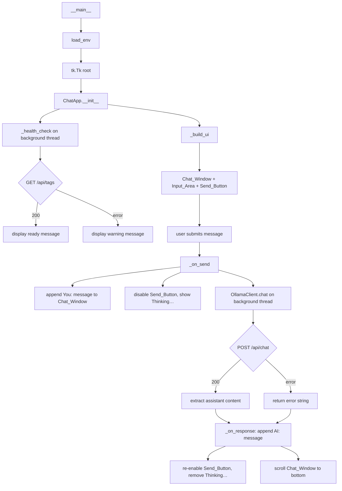

# Design Document: tk-log-chat

## Overview

`sc/tk_log_chat.py` is a standalone Tkinter desktop chat application that lets a developer paste error messages and log text, then sends the input to a local Ollama model and displays the AI's explanation in a chat-style UI.

The app is self-contained: no imports from `app/`, stdlib + `requests` + `python-dotenv` only, runnable as `python sc/tk_log_chat.py` from the project root.

Key characteristics:
- Two-panel layout: scrollable read-only Chat_Window (top) + Input_Area + Send_Button (bottom)
- Background thread for HTTP requests to keep the UI responsive
- Conversation history maintained in memory for multi-turn context
- Color-coded chat bubbles distinguishing user vs AI messages
- Ctrl+Enter shortcut to send
- Startup health check to `/api/tags` with a ready/error message in the Chat_Window

---

## Architecture

The app is a single-file Python module built around one class (`ChatApp`) that owns the Tkinter root window and all widgets. A module-level `OllamaClient` handles HTTP communication. Environment loading runs at module import time via `load_env()`.



**Design decisions:**
- Single class (`ChatApp`) keeps all widget state co-located and avoids global widget references.
- `OllamaClient` is a plain class (no Tkinter dependency) so it can be unit-tested without a display.
- Background threads use `root.after(0, callback)` to marshal results back to the main thread safely — the standard Tkinter thread-safety pattern.
- Conversation history is a plain `list[dict]` on `OllamaClient`, appended after each round-trip.
- `load_env()` is called once at startup; constants `OLLAMA_BASE_URL` and `OLLAMA_MODEL` are module-level so both `ChatApp` and `OllamaClient` can read them without coupling.

---

## Components and Interfaces

### `load_env() -> None`

Calls `dotenv.load_dotenv()` (if `python-dotenv` is available), then reads `OLLAMA_BASE_URL` and `OLLAMA_MODEL` into module-level constants with fallbacks.

```python
OLLAMA_BASE_URL: str  # default "http://localhost:11434"
OLLAMA_MODEL: str     # default "llama3"
```

### `OllamaClient`

Stateful client that owns the conversation history and performs HTTP calls.

```python
class OllamaClient:
    history: list[dict]  # {"role": "user"|"assistant", "content": str}

    def health_check(self) -> tuple[bool, str]:
        """GET /api/tags. Returns (ok, message)."""

    def chat(self, user_message: str) -> str:
        """
        Append user_message to history, POST /api/chat with full history,
        append assistant reply to history, return reply string.
        On any error, return a human-readable error string (never raise).
        """
```

### `ChatApp`

Owns the Tkinter root and all widgets.

```python
class ChatApp:
    def __init__(self, root: tk.Tk, client: OllamaClient) -> None: ...

    def _build_ui(self) -> None:
        """Create Chat_Window, Input_Area, Send_Button, bind Ctrl+Enter."""

    def _health_check(self) -> None:
        """Run OllamaClient.health_check on a background thread; post result to Chat_Window."""

    def _on_send(self, event=None) -> None:
        """Read Input_Area, validate, append to Chat_Window, dispatch to background thread."""

    def _on_response(self, reply: str) -> None:
        """Called on main thread via root.after(); append AI reply, re-enable button."""

    def _append_message(self, role: str, text: str) -> None:
        """Insert text into Chat_Window with the appropriate color tag."""

    def _scroll_to_bottom(self) -> None:
        """Move Chat_Window yview to end."""
```

### Widget layout

```
┌─────────────────────────────────────────┐
│  Chat_Window  (Text, state=DISABLED,    │
│               fill=BOTH, expand=True)   │
├─────────────────────────────────────────┤
│  Input_Area   (Text, height=5,          │
│               fill=X, expand=False)     │
│  [Send_Button]                          │
└─────────────────────────────────────────┘
```

- `Chat_Window`: `tk.Text` with `state=tk.DISABLED`, `wrap=tk.WORD`, vertical `Scrollbar`.
- `Input_Area`: `tk.Text` with `height=5`, `wrap=tk.WORD`.
- `Send_Button`: `ttk.Button` bound to `_on_send`.
- `Ctrl+Enter` bound on `Input_Area` to `_on_send`.
- Minimum window size: `root.minsize(700, 500)`.

---

## Data Models

### Conversation history entry

```python
{"role": "user" | "assistant", "content": str}
```

### Ollama `/api/chat` request payload

```json
{
  "model": "<OLLAMA_MODEL>",
  "stream": false,
  "messages": [
    {"role": "system", "content": "<system prompt>"},
    {"role": "user",   "content": "<first user message>"},
    {"role": "assistant", "content": "<first reply>"},
    ...
    {"role": "user",   "content": "<latest user message>"}
  ]
}
```

The system prompt instructs the model to act as a senior developer explaining errors and logs in plain language with actionable fix steps.

### Ollama `/api/chat` response (relevant fields)

```json
{
  "message": {
    "role": "assistant",
    "content": "<explanation text>"
  }
}
```

### Ollama `/api/tags` response (health check)

Any HTTP 200 response is treated as success; the body is not parsed.

### Chat_Window text tags

| Tag name   | Applied to          | Style                        |
|------------|---------------------|------------------------------|
| `user`     | "You: …" lines      | foreground `#1a73e8` (blue)  |
| `ai`       | "AI: …" lines       | foreground `#2e7d32` (green) |
| `system`   | Status/error lines  | foreground `#757575` (grey)  |

---

## Correctness Properties

*A property is a characteristic or behavior that should hold true across all valid executions of a system — essentially, a formal statement about what the system should do. Properties serve as the bridge between human-readable specifications and machine-verifiable correctness guarantees.*

### Property 1: Non-empty input is echoed to Chat_Window with "You:" prefix

*For any* non-empty, non-whitespace string placed in the Input_Area and submitted, the Chat_Window content SHALL contain a line beginning with "You:" followed by that exact string.

**Validates: Requirements 2.1, 2.3**

### Property 2: Whitespace-only input is rejected

*For any* string composed entirely of whitespace characters (spaces, tabs, newlines), submitting it SHALL result in no new message being appended to the Chat_Window and no HTTP request being made to the AI_Client.

**Validates: Requirements 2.2**

### Property 3: POST payload is well-formed for any user message

*For any* non-empty user message string, the POST request body sent to `/api/chat` SHALL contain `"stream": false`, the configured model name, and a `messages` array whose first element has `"role": "system"` and whose last element has `"role": "user"` with `"content"` equal to the submitted message.

**Validates: Requirements 3.1**

### Property 4: Conversation history is fully included in every request

*For any* sequence of N completed user/assistant message pairs followed by a new user message, the `messages` array in the next POST request SHALL contain all N prior pairs (in order) plus the new user message, so that no prior context is lost.

**Validates: Requirements 3.2**

### Property 5: Assistant content is correctly extracted from any valid response

*For any* valid Ollama `/api/chat` JSON response with an arbitrary `message.content` string, `OllamaClient.chat` SHALL return that exact string as the assistant reply.

**Validates: Requirements 3.3**

### Property 6: Any AI_Client failure returns a string, never raises

*For any* failure mode of the HTTP call (connection error, timeout, or any non-200 HTTP status code), `OllamaClient.chat` SHALL return a non-empty human-readable string describing the failure and SHALL NOT raise an exception.

**Validates: Requirements 3.4**

### Property 7: Assistant reply is echoed to Chat_Window with "AI:" prefix

*For any* assistant reply string returned by `OllamaClient.chat`, the Chat_Window content SHALL contain a line beginning with "AI:" followed by that reply text.

**Validates: Requirements 4.1**

### Property 8: Health check failure always shows a warning containing the attempted URL

*For any* health check failure (connection error or non-200 HTTP status), the Chat_Window SHALL display a message that contains the `OLLAMA_BASE_URL` value that was tried.

**Validates: Requirements 5.2**

### Property 9: Health check success shows the configured model name

*For any* value of `OLLAMA_MODEL` configured in the environment, when the health check succeeds the Chat_Window SHALL display a ready message that contains that model name.

**Validates: Requirements 5.3**

### Property 10: Environment variable fallback correctness

*For any* combination of `OLLAMA_BASE_URL` and `OLLAMA_MODEL` being set or absent in the environment, the values used by the app SHALL equal the environment variable value when set, or the default (`http://localhost:11434` / `llama3`) when absent.

**Validates: Requirements 6.2**

---

## Error Handling

| Failure scenario | Behaviour |
|---|---|
| Input_Area is empty or whitespace-only | No action; focus stays on Input_Area |
| Health check connection error | Display warning in Chat_Window with URL; Send_Button stays enabled |
| Health check non-200 response | Same as above |
| `requests.post` raises `ConnectionError` / `Timeout` | `OllamaClient.chat` returns human-readable error string; displayed in Chat_Window as AI reply |
| Ollama returns non-200 HTTP status | Same as above |
| Malformed JSON in Ollama response | Catch `KeyError`/`ValueError`; return error string |
| Background thread exception | Caught inside thread; error string marshalled back via `root.after()` |

No unhandled exceptions escape to the Tkinter event loop. All error paths surface as readable messages in the Chat_Window.

---

## Testing Strategy

### Unit tests (example-based)

- `OllamaClient.health_check` with mocked 200 → returns `(True, message)`.
- `OllamaClient.health_check` with mocked connection error → returns `(False, message)` containing the URL.
- `OllamaClient.health_check` with mocked non-200 → returns `(False, message)`.
- `OllamaClient.chat` with mocked 200 response → returns assistant content string.
- `OllamaClient.chat` with mocked connection error → returns error string, no exception.
- `OllamaClient.chat` with mocked 500 response → returns error string, no exception.
- `OllamaClient.chat` with malformed JSON → returns error string, no exception.
- `ChatApp._on_send` with empty Input_Area → Chat_Window unchanged, no HTTP call.
- `ChatApp._on_send` with whitespace-only Input_Area → same as above.
- `ChatApp._on_send` with valid text → Send_Button disabled, "Thinking…" in Chat_Window.
- `ChatApp._on_response` → Send_Button re-enabled, "Thinking…" removed, AI reply in Chat_Window.
- Ctrl+Enter binding triggers `_on_send`.
- Window title is "Log & Error Chat".
- Window minsize is (700, 500).
- Chat_Window has `state=DISABLED` (read-only).
- `.env` file values are loaded when present.

### Property-based tests (Hypothesis)

The feature contains pure transformation logic in `OllamaClient` (payload building, response parsing, history accumulation) and input validation logic in `ChatApp` that are well-suited to property-based testing. Use **Hypothesis** (already available in the project via `.hypothesis/`).

Each property test runs a minimum of **100 iterations**.

Tag format: `# Feature: tk-log-chat, Property N: <property text>`

| Property | Test description |
|---|---|
| P1 | Generate random non-empty, non-whitespace strings; simulate submission; assert Chat_Window contains "You: <text>" |
| P2 | Generate strings from `st.text(alphabet=st.characters(whitelist_categories=("Zs","Cc")))` plus pure space/tab/newline strings; assert no Chat_Window append and no HTTP call |
| P3 | Generate random non-empty message strings; capture the POST payload via mock; assert `stream==False`, correct model, system role first, user role last with correct content |
| P4 | Generate random sequences of 1–20 user/assistant pairs; build history; assert next POST payload messages array contains all prior pairs in order |
| P5 | Generate random `message.content` strings in a valid Ollama response JSON; assert `OllamaClient.chat` returns that exact string |
| P6 | Generate connection errors and non-200 status codes; assert `OllamaClient.chat` returns a non-empty string and does not raise |
| P7 | Generate random assistant reply strings; simulate response; assert Chat_Window contains "AI: <reply>" |
| P8 | Generate random OLLAMA_BASE_URL values; simulate health check failure; assert Chat_Window message contains that URL |
| P9 | Generate random model name strings; simulate successful health check; assert Chat_Window ready message contains the model name |
| P10 | Test all four combinations of OLLAMA_BASE_URL / OLLAMA_MODEL presence/absence; assert resolved values match env var or default |
