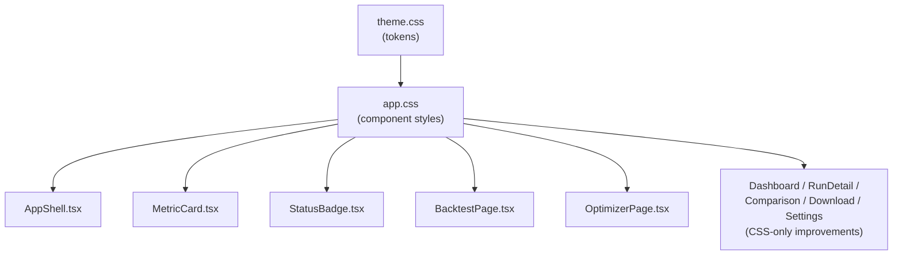

# Design Document — Web UI Redesign

## Overview

This document describes the technical design for the `web-ui-redesign` feature, which delivers a full visual and UX redesign of the Freqtrade Strategy Workstation React SPA (`app/re_web/src/`).

The redesign is **purely additive within the existing CSS custom-property system**. No new npm packages are introduced. All changes land in seven files:

| File | Change type |
|---|---|
| `app/re_web/src/styles/theme.css` | New design tokens (typography, spacing, elevation) |
| `app/re_web/src/styles/app.css` | Updated component styles using new tokens |
| `app/re_web/src/components/AppShell.tsx` | Active-link `aria-current`, left accent bar markup |
| `app/re_web/src/components/MetricCard.tsx` | No structural change needed — CSS drives the redesign |
| `app/re_web/src/components/StatusBadge.tsx` | Pulse animation class for `running` state |
| `app/re_web/src/pages/BacktestPage.tsx` | Workflow-step JSX restructure |
| `app/re_web/src/pages/OptimizerPage.tsx` | Workflow-step JSX restructure |

All other pages (Dashboard, RunDetail, Comparison, Download, Settings) receive improvements exclusively through the updated CSS — no TSX changes are required for them.

### Design Principles

1. **Token-first** — every size, colour, and shadow value references a CSS custom property; no magic numbers in component styles.
2. **Progressive enhancement** — the existing layout and functionality are preserved; the redesign layers visual polish on top.
3. **Workflow clarity** — Backtest and Optimizer pages are restructured into explicit numbered steps so users always know where they are in the process.
4. **Accessibility parity** — all existing ARIA attributes are preserved; new interactive elements follow the same patterns.

---

## Architecture

The UI is a Vite + React SPA. Styling is split across two files:

```
app/re_web/src/styles/
  theme.css   ← CSS custom properties (design tokens)
  app.css     ← component and layout styles that consume the tokens
```

`theme.css` is imported once at the app root. `app.css` contains all component rules. No CSS modules or scoped styles are used — all selectors are global class names.

The redesign follows this layering:

```
theme.css  (tokens)
    ↓
app.css    (component rules using var(--token))
    ↓
TSX        (className strings, minimal inline style only for dynamic values)
```

Dynamic values that depend on runtime state (e.g. tone colour on a metric bar, best-trial border) continue to use `style={{ ... }}` inline props in TSX, referencing CSS custom properties rather than hard-coded colour strings.

### Mermaid — File Dependency Graph



---

## Components and Interfaces

### 1. Design System Tokens (`theme.css`)

New tokens are appended to the existing `:root` block and mirrored in `:root[data-theme='light']`. Existing tokens are untouched.

**Typography scale**

```css
--text-xs:   11px;
--text-sm:   12px;
--text-base: 14px;
--text-lg:   16px;
--text-xl:   20px;
--text-2xl:  24px;
```

**Spacing scale** (4-px base unit)

```css
--space-1: 4px;
--space-2: 8px;
--space-3: 12px;
--space-4: 16px;
--space-5: 20px;
--space-6: 24px;
```

**Elevation tokens**

```css
--shadow-sm: 0 1px 4px rgba(0,0,0,0.18), 0 2px 8px rgba(0,0,0,0.10);
--shadow-md: 0 4px 16px rgba(0,0,0,0.22), 0 8px 24px rgba(0,0,0,0.12);
```

Light-mode equivalents use lower opacity values appropriate for a light background.

### 2. AppShell / Sidebar (`AppShell.tsx` + `app.css`)

**No structural changes to the JSX layout.** The sidebar already has the correct grid structure (`grid-template-rows: auto 1fr auto`). Changes:

- Sidebar width set to `240px` via `.app-shell { grid-template-columns: 240px minmax(0,1fr) }`.
- `.nav-link.active` gains a `4px` left accent bar via `::before` pseudo-element with `background: var(--accent)`.
- `aria-current="page"` is added to the active `<a>` element in `AppShell.tsx`.
- Brand block: icon size stays 22px; `strong` uses `var(--text-base)` font-size; `span` subtitle uses `var(--text-xs)` and `var(--muted)`.
- Theme toggle button moves to the sidebar footer (already in position — CSS ensures it stays at the bottom of the `1fr` grid row).

**Active link visual spec:**

```
┌─────────────────────────────────┐
│ ▌ 🏠  Dashboard                 │  ← 4px accent bar (::before), surface-2 bg, --text colour
│    📊  Backtest                  │  ← muted colour, transparent bg
└─────────────────────────────────┘
```

### 3. MetricCard (`MetricCard.tsx` + `app.css`)

The component structure is unchanged. CSS drives all visual changes:

- `.metric-card-bar` — already exists as a `<span>` at the top of the card; CSS sets `height: 3px`, `width: 100%`, `display: block`.
- `.metric-label` — `text-transform: uppercase`, `font-size: var(--text-xs)`, `color: var(--muted)`, `letter-spacing: 0.05em`.
- `.metric-value` — `font-size: var(--text-xl)`, `font-weight: 700`.
- `.metric-detail` — `font-size: var(--text-xs)`, `color: var(--muted)`.
- `.metric-card:hover` — `box-shadow: var(--shadow-md)` (elevated from `--shadow-sm` at rest).
- `.metric-card` at rest — `box-shadow: var(--shadow-sm)`.

Tone colours are already applied via `.tone-good .metric-value { color: var(--green) }` etc. No TSX changes needed.

**Responsive grid:**

```css
.metric-grid {
  grid-template-columns: repeat(6, minmax(120px, 1fr));   /* wide */
}
@media (max-width: 1050px) {
  .metric-grid { grid-template-columns: repeat(3, minmax(150px, 1fr)); }
}
@media (max-width: 680px) {
  .metric-grid { grid-template-columns: repeat(2, 1fr); }
}
```

### 4. Panel Elevation (`app.css`)

```css
.panel {
  padding: var(--space-4);
  box-shadow: var(--shadow-sm);
}
.panel-header {
  border-bottom: 1px solid var(--border);
  padding-bottom: var(--space-3);
  margin-bottom: var(--space-3);
}
```

When a panel contains a `.table-wrap`, the table is rendered flush by applying negative horizontal margins on `.table-wrap` inside `.panel`:

```css
.panel > .table-wrap {
  margin-left: calc(-1 * var(--space-4));
  margin-right: calc(-1 * var(--space-4));
  width: calc(100% + 2 * var(--space-4));
}
```

### 5. Button and Input States (`app.css`)

```css
.button:disabled,
.icon-button:disabled {
  opacity: 0.45;
  cursor: not-allowed;
}

input:focus,
select:focus,
textarea:focus {
  outline: 2px solid var(--accent);
  outline-offset: -1px;
  border-color: var(--accent);
}

.button:hover,
.icon-button:hover {
  background: var(--surface-3);
}

.button.primary {
  color: #06110f;
  background: var(--accent);
  border-color: var(--accent-strong);
}
.button.primary:hover {
  background: var(--accent-strong);
}
```

### 6. StatusBadge (`StatusBadge.tsx` + `app.css`)

The component gains an explicit `idle` state and a `running` pulse animation:

```css
@keyframes pulse-badge {
  0%, 100% { opacity: 1; }
  50%       { opacity: 0.55; }
}

.status-badge.tone-warn {
  animation: pulse-badge 1.4s ease-in-out infinite;
}
```

The TSX logic is extended to map `idle` → `neutral` (muted, no animation), `running` → `warn` (amber + pulse), `complete` → `good` (green), `error` → `bad` (red).

### 7. Alert (`app.css`)

```css
.alert {
  border-left: 4px solid var(--border);
  background: var(--surface);
}
.alert.error {
  border-left-color: var(--red);
  background: color-mix(in srgb, var(--red), var(--surface) 92%);
}
.alert.warn {
  border-left-color: var(--amber);
  background: color-mix(in srgb, var(--amber), var(--surface) 92%);
}
.alert.success {
  border-left-color: var(--green);
  background: color-mix(in srgb, var(--green), var(--surface) 92%);
}
```

### 8. Workflow Step Component (`app.css`)

A new `.workflow-step` CSS class provides the numbered-step visual treatment used on Backtest and Optimizer pages:

```css
.workflow-step {
  display: grid;
  gap: var(--space-3);
}

.workflow-step-header {
  display: flex;
  align-items: center;
  gap: var(--space-3);
  padding-bottom: var(--space-2);
}

.step-badge {
  display: inline-flex;
  align-items: center;
  justify-content: center;
  width: 26px;
  height: 26px;
  border-radius: 50%;
  font-size: var(--text-xs);
  font-weight: 700;
  background: var(--surface-2);
  color: var(--muted);
  border: 1.5px solid var(--border);
  flex-shrink: 0;
}

.workflow-step.active .step-badge {
  background: var(--accent);
  color: #06110f;
  border-color: var(--accent-strong);
}

.workflow-step h2 {
  font-size: var(--text-base);
  font-weight: 650;
  color: var(--text);
}
```

**JSX pattern** (used in both BacktestPage and OptimizerPage):

```tsx
<section className="workflow-step active">
  <div className="workflow-step-header">
    <span className="step-badge">1</span>
    <h2>Configure</h2>
  </div>
  <div className="panel form-grid">
    {/* form fields */}
  </div>
</section>
```

### 9. Backtest Page Workflow (`BacktestPage.tsx`)

The existing flat layout is restructured into three `<section className="workflow-step">` elements:

```
Step 1 — Configure
  └── .panel.form-grid  (strategy, timeframe, preset, timerange, wallet, max trades)

Step 2 — Pairs
  └── .panel  (chip-grid of available pairs + selected pairs display)

Step 3 — Run & Monitor
  ├── .workflow-step-header  (step badge + "Run & Monitor" heading + StatusBadge)
  ├── .button-row  (Start, Stop, Download buttons)
  ├── .loading-bar  (visible when status === 'running')
  └── .panel  (terminal output)
```

The `active` class is applied to the step that corresponds to the current workflow state:
- No strategy selected → Step 1 active
- Strategy selected, no pairs → Step 2 active  
- Pairs selected or run in progress → Step 3 active

### 10. Optimizer Page Workflow (`OptimizerPage.tsx`)

Restructured into three `<section className="workflow-step">` elements:

```
Step 1 — Configure
  └── .panel.form-grid  (strategy, timeframe, pairs, timerange, trials, scoring fields)

Step 2 — Parameter Space
  ├── .workflow-step-header  (step badge + "Parameter Space" heading + "Load Params" button)
  └── .panel  (param-list)

Step 3 — Run & Monitor
  ├── .workflow-step-header  (step badge + "Run & Monitor" heading + StatusBadge + Start/Stop)
  ├── .loading-bar  (visible when streaming)
  ├── .panel  (session table)
  ├── .panel  (trial grid — best tile has accent left border + ★)
  └── .panel  (live log terminal, shown when liveLog || streaming)
```

---

## Data Models

No new data models are introduced. The redesign is purely presentational. Existing TypeScript types (`PreferenceSection`, `BacktestStatus`, `TrialRecord`, `OptimizerSessionSummary`, etc.) are unchanged.

The only data-adjacent change is in `StatusBadge.tsx` where the tone-mapping logic is made explicit for the four canonical status values:

```typescript
// Explicit mapping (replaces substring matching)
const TONE_MAP: Record<string, string> = {
  idle:     'neutral',
  running:  'warn',
  started:  'warn',
  complete: 'good',
  success:  'good',
  error:    'bad',
  failed:   'bad',
};
const tone = TONE_MAP[normalized] ?? (
  normalized.includes('run') || normalized.includes('start') ? 'warn' :
  normalized.includes('complete') || normalized.includes('success') ? 'good' :
  normalized.includes('fail') || normalized.includes('error') ? 'bad' :
  'neutral'
);
```

The fallback substring matching is preserved for backward compatibility with any status strings not in the explicit map.

---

## Correctness Properties

*A property is a characteristic or behavior that should hold true across all valid executions of a system — essentially, a formal statement about what the system should do. Properties serve as the bridge between human-readable specifications and machine-verifiable correctness guarantees.*

This feature is suitable for property-based testing in the following areas: CSS token completeness (the token set is a finite but variable collection), component tone rendering (tone is a discrete input space), and component structural invariants (workflow step structure, status badge mapping). The property-based testing library used is **fast-check** (already available in the Vite/React ecosystem via `npm install --save-dev fast-check`).

### Property 1: Design Token Parity Across Themes

*For any* token name in the set of new design tokens (`--text-xs`, `--text-sm`, `--text-base`, `--text-lg`, `--text-xl`, `--text-2xl`, `--space-1` through `--space-6`, `--shadow-sm`, `--shadow-md`), the CSS text of `theme.css` must define that token in both the `:root` block and the `:root[data-theme='light']` block.

**Validates: Requirements 1.1, 1.2, 1.3, 1.4**

### Property 2: Existing Token Preservation

*For any* token name in the set of existing tokens (`--bg`, `--surface`, `--surface-2`, `--surface-3`, `--text`, `--muted`, `--border`, `--accent`, `--accent-strong`, `--amber`, `--red`, `--green`, `--blue`, `--shadow`, `--radius`, `--font`), the updated `theme.css` must still define that token in the `:root` block.

**Validates: Requirements 1.5**

### Property 3: MetricCard Tone Rendering Invariant

*For any* tone value in `{good, bad, warn, neutral}`, rendering a `MetricCard` with that tone must produce:
- a `.metric-card-bar` element with a non-empty `background` style referencing the correct CSS variable for that tone, and
- a `.metric-value` element whose computed colour class or inline style matches the tone's colour variable (`--green`, `--red`, `--amber`, `--accent` respectively).

**Validates: Requirements 4.1, 4.3**

### Property 4: Workflow Step Structure Invariant

*For any* workflow page component (`BacktestPage`, `OptimizerPage`), the rendered output must contain exactly three `.workflow-step` elements, each with a `.step-badge` child containing the step number (1, 2, or 3) and a `<h2>` child containing the step heading. The step headings for `BacktestPage` must be `Configure`, `Pairs`, and `Run & Monitor`; for `OptimizerPage` they must be `Configure`, `Parameter Space`, and `Run & Monitor`.

**Validates: Requirements 7.1, 8.1**

### Property 5: Progress Indicator on Active Operation

*For any* `BacktestPage` state where `status.status === 'running'`, the rendered output must contain a `.loading-bar` element. *For any* `OptimizerPage` state where `streaming === true`, the rendered output must contain a `.loading-bar` element within Step 3.

**Validates: Requirements 7.7, 8.5, 9.1**

### Property 6: StatusBadge Tone Mapping

*For any* status string in `{idle, running, complete, error}`, `StatusBadge` must render a `<span>` with the class `status-badge tone-{expected}` where `expected` is `neutral`, `warn`, `good`, `bad` respectively. The mapping must be injective — no two canonical status values may produce the same tone class.

**Validates: Requirements 9.2**

### Property 7: Best Trial Tile Invariant

*For any* trial record where `is_best === true`, the rendered trial tile must have a `border-left` style referencing `var(--accent)` and must contain a star character (`★` or `*`) as a visible text node.

**Validates: Requirements 8.6**

### Property 8: Empty State Invariant

*For any* `OptimizerPage` state where the `trials` array is empty, the trial grid area within Step 3 must contain an element with the class `empty-state`. *For any* `BacktestPage` state where `availablePairs` is empty, the pairs chip-grid area within Step 2 must render without crashing and must not render any `.chip` elements.

**Validates: Requirements 8.8**

---

## Error Handling

### CSS Token Fallbacks

All new CSS custom properties include fallback values in the `var()` call sites where the token might not be defined (e.g. in older browser contexts):

```css
font-size: var(--text-base, 14px);
padding: var(--space-4, 16px);
box-shadow: var(--shadow-sm, 0 1px 4px rgba(0,0,0,0.18));
```

### Component Error Boundaries

No new error boundaries are introduced. The existing pattern of rendering `null` or an empty-state element when data is absent is preserved in all restructured page components.

### StatusBadge Unknown Status

The `StatusBadge` component retains its fallback substring-matching logic so that any status string not in the explicit map still receives a reasonable tone class. Unknown statuses fall back to `neutral` (muted, no animation).

### Workflow Step Active State

The `active` class on workflow steps is computed from existing state variables (`prefs.last_strategy`, `selectedPairs.length`, `status.status`, `streaming`). If state is indeterminate, Step 1 is always active by default — the UI never shows no active step.

### Disabled Button States

The `disabled` attribute on Start/Stop buttons is already managed by existing state logic. The CSS `opacity: 0.45; cursor: not-allowed` rule applies automatically via the `:disabled` pseudo-class — no additional TSX changes are needed.

---

## Testing Strategy

### Dual Testing Approach

Unit tests verify specific examples, edge cases, and error conditions. Property-based tests verify universal properties across all valid inputs. Both are necessary for comprehensive coverage.

### Property-Based Testing

**Library:** `fast-check` (install as dev dependency: `npm install --save-dev fast-check`)

**Configuration:** Minimum 100 iterations per property test.

**Tag format:** `// Feature: web-ui-redesign, Property {N}: {property_text}`

Each correctness property maps to a single property-based test:

| Property | Test file | fast-check arbitraries |
|---|---|---|
| P1: Token parity | `theme.test.ts` | `fc.constantFrom(...newTokenNames)` |
| P2: Token preservation | `theme.test.ts` | `fc.constantFrom(...existingTokenNames)` |
| P3: MetricCard tone | `MetricCard.test.tsx` | `fc.constantFrom('good','bad','warn','neutral')` |
| P4: Workflow step structure | `BacktestPage.test.tsx`, `OptimizerPage.test.tsx` | Component render, assert DOM structure |
| P5: Progress indicator | `BacktestPage.test.tsx`, `OptimizerPage.test.tsx` | `fc.record({ status: fc.constant('running') })` |
| P6: StatusBadge mapping | `StatusBadge.test.tsx` | `fc.constantFrom('idle','running','complete','error')` |
| P7: Best trial tile | `OptimizerPage.test.tsx` | `fc.record({ is_best: fc.constant(true), trial_number: fc.nat() })` |
| P8: Empty state | `OptimizerPage.test.tsx`, `BacktestPage.test.tsx` | Empty array state |

### Unit Tests

Unit tests cover:

- **theme.css parsing** — assert all new token names are present in both `:root` and `:root[data-theme='light']` blocks.
- **app.css rules** — assert `.panel` has `box-shadow: var(--shadow-sm)`, `.button:disabled` has `opacity: 0.45`, `.alert.error` has `border-left-color: var(--red)`.
- **AppShell** — render with active path, assert `aria-current="page"` on the active link and not on others.
- **MetricCard** — render with each tone, assert correct bar colour and value colour class.
- **StatusBadge** — render with each canonical status, assert correct `tone-*` class.
- **BacktestPage** — render with `status.status === 'running'`, assert `.loading-bar` is present; render with `status.status === 'complete'`, assert `.alert` is present.
- **OptimizerPage** — render with `streaming === true`, assert `.loading-bar` in Step 3; render with `trials === []`, assert `.empty-state` in trial grid.

### Integration Tests

No new integration tests are required. The redesign is purely presentational and does not change any API calls, SSE handling, or data-fetching logic.

### Visual Regression (Manual)

After implementation, manually verify:

1. Dark mode and light mode render correctly at 1440px, 1024px, 768px, and 375px viewport widths.
2. The sidebar active-link accent bar is visible and correctly positioned.
3. MetricCard hover elevation is smooth (no layout shift).
4. Workflow steps on Backtest and Optimizer pages are visually distinct and the active step is clearly highlighted.
5. The StatusBadge pulse animation plays for `running` status and stops for other statuses.
6. All buttons show `not-allowed` cursor when disabled.
7. Focus rings are visible on all interactive elements when navigating by keyboard.
